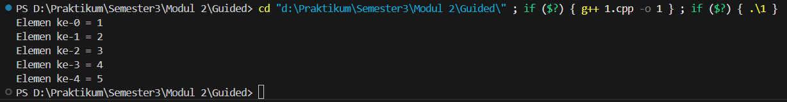
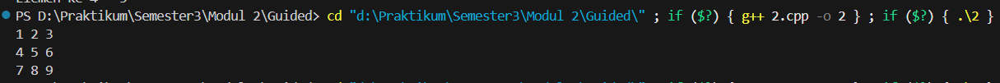
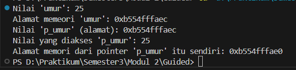
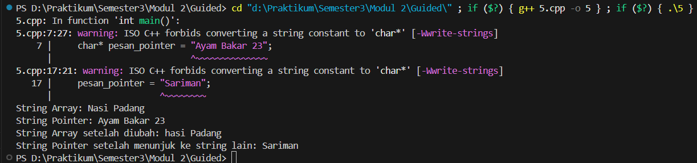
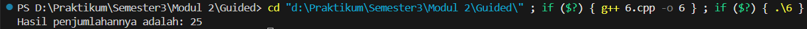
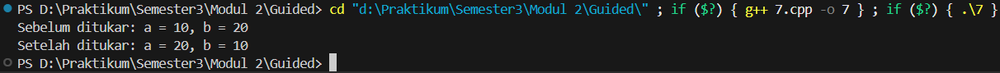
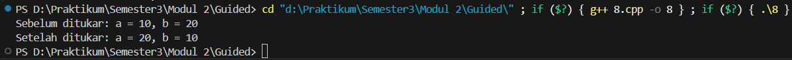
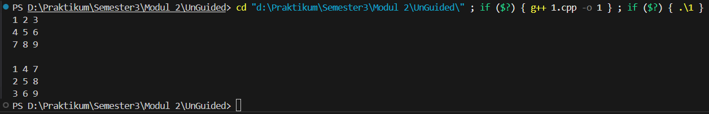
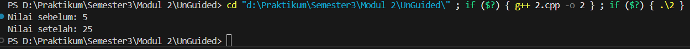

# <h1 align="center">LAPORAN PRAKTIKUM MODUL 2 <br> PENGENALAN BAHASA C++ (BAGIAN KEDUA)</h1>
<p align="center">SETYO NUGROHO - 103112400024</p>

## Dasar Teori

Dalam bahasa pemrograman C++, konsep seperti array, pointer, string, dan fungsi (function/procedure) adalah dasar penting untuk memahami bagaimana data disimpan dan diproses di memori.

Array digunakan untuk menyimpan sekumpulan data dengan tipe yang sama.

Pointer adalah variabel yang menyimpan alamat memori dari variabel lain.

String bisa diwakili dengan array karakter atau pointer ke karakter.

Fungsi dan prosedur membantu membuat program lebih terstruktur.

Parameter by reference (&) dan pointer (*) memungkinkan fungsi mengubah nilai asli variabel di luar fungsinya.


## Guided

### Array 1

```cpp
#include <iostream>
using namespace std;

int main()
{
    int nilai[5] = {1, 2, 3, 4, 5};

    for (int i = 0; i < 5; ++i)
    {
        cout << "Elemen ke-" << i << " = " << nilai[i] << endl;
    }
    return 0;
}
```
> Output
> 

Konsep utama dari program ini adalah bagaimana sebuah array menyimpan banyak data dalam satu variabel, serta bagaimana kita bisa mengakses tiap elemen berdasarkan indeksnya.

### Array 2

```cpp
#include <iostream>
using namespace std;

int main()

{
    int matriks[3][3] = {
        {1, 2, 3},
        {4, 5, 6},
        {7, 8, 9}};

    for (int i = 0; i < 3; ++i)
    {
        for (int j = 0; j < 3; ++j)
        {
            cout << matriks[i][j] << " ";
        }
        cout << endl;
    }
    return 0;
}
```

> Output
> 

Program ini menunjukkan konsep dasar representasi data dalam bentuk tabel atau grid, yang sering digunakan untuk menyimpan data numerik atau koordinat. Dengan memahami matriks, kita bisa mengembangkan operasi lebih lanjut seperti transpose, penjumlahan, atau perkalian matriks.

### Pointer

```cpp
#include <iostream>
using namespace std;

int main()
{
    int umur = 25;
    int *p_umur;

    p_umur = &umur;

    cout << "Nilai 'umur': " << umur << endl;
    cout << "Alamat memeori 'umur': " << &umur << endl;
    cout << "Nilai 'p_umur' (alamat): " <<p_umur << endl;
    cout << "Nilai yang diakses 'p_umur': " << *p_umur << endl;
    cout << "Alamat memori dari pointer 'p_umur' itu sendiri: " << &p_umur << endl;

    return 0;
}
```

> Output
> 

Kode ini menampilkan alamat memori dari pointer itu sendiri. Melalui contoh ini, pengguna belajar bahwa pointer memberikan kontrol langsung terhadap memori, yang sangat penting dalam pengelolaan data tingkat rendah dan efisiensi program.

### Array Pointer

```cpp
#include <iostream>
using namespace std;

int main()
{
    int data[5] = {10, 20, 30, 40, 50};
    int *p_data = data;

    cout << "Mengakses elemen array cara normal: " << endl;

    for (int i = 0; i < 5; ++i)
    {
        cout << "Nilai elemen ke- " << i << ": " << data[i] << endl;
    }

    cout << "Mengakses elemen array menggunakan pointer:" << endl;

    for (int i = 0; i < 5; ++i)
    {
        cout << "Nilai elemen ke-" << i << ": " << *(p_data + i) << endl;
    }
    return 0;
}
```

> Output
> 

Program ini memperlihatkan bagaimana pointer bisa digunakan untuk mengakses isi dari sebuah array tanpa harus menggunakan indeks biasa. Di dalam program, array data berisi lima elemen bernilai 10, 20, 30, 40, dan 50. Pointer p_data kemudian diinisialisasi agar menunjuk ke alamat elemen pertama dari array tersebut.

### String Pointer

```cpp
#include <iostream>
using namespace std;

int main()
{
    char pesan_array[] = "Nasi Padang";
    char* pesan_pointer = "Ayam Bakar 23";

    cout << "String Array: " << pesan_array << endl;
    cout << "String Pointer: " << pesan_pointer << endl;

    // Mengubah karakter dalam array diperbolehkan
    pesan_array[0] = 'h';
    cout << "String Array setelah diubah: " << pesan_array << endl;

    // Pointer dapat diubah untuk menunjuk ke string lain
    pesan_pointer = "Sariman";
    cout << "String Pointer setelah menunjuk ke string lain: " << pesan_pointer << endl;

    return 0;
}
```

> Output
> 

Program ini membandingkan dua cara dalam mendeklarasikan string di C++. Yang pertama menggunakan array karakter (char pesan_array[]), dan yang kedua menggunakan pointer ke string literal (char* pesan_pointer). Program ini mengajarkan perbedaan mendasar antara penyimpanan string statis dan dinamis, serta bagaimana memori string dikelola di C++.

### Fungsi Prosedur

```cpp
#include <iostream>

int hitungJumlah(int a, int b)
{
    return a + b;
}

void tampilkanHasil(int hasil)
{
    std::cout << "Hasil penjumlahannya adalah: " << hasil << std::endl;
}

int main()
{
    int angka1 = 15;
    int angka2 = 10;
    int hasilJumlah;

    hasilJumlah = hitungJumlah(angka1, angka2);
    tampilkanHasil(hasilJumlah);

    return 0;
}
```

> Output
> 

Konsep ini memperkenalkan pembagian tugas antar fungsi: satu fungsi untuk perhitungan, satu lagi untuk output. Pendekatan seperti ini membuat program lebih terstruktur, mudah diperbaiki, dan dapat digunakan ulang (reusable).

### Call By Pointer

```cpp
#include <iostream>
using namespace std;

void tukar(int *px, int *py)
{
    int temp = *px;
    *px = *py;
    *py = temp;
}

int main()
{
    int a = 10, b = 20;
    cout << "Sebelum ditukar: a = " << a << ", b = " << b << endl;
    tukar(&a, &b);
    cout << "Setelah ditukar: a = " << a << ", b = " << b << endl;
    return 0;
}
```
> Output
> 

Program ini mendemonstrasikan mekanisme call by pointer, yaitu cara mengirim alamat variabel ke dalam fungsi agar nilainya bisa diubah dari luar fungsi. Program ini menjelaskan bagaimana pointer digunakan untuk manipulasi data antar fungsi secara efisien.

### Call By Reference

```cpp
#include <iostream>
using namespace std;

void tukar(int &x, int &y)
{
    int temp = x;
    x = y;
    y = temp;
}

int main()
{
    int a = 10, b = 20;
    cout << "Sebelum ditukar: a = " << a << ", b = " << b << endl;
    tukar(a, b);
    cout << "Setelah ditukar: a = " << a << ", b = " << b << endl;
    return 0;
}
```
> Output
> 

Program ini mirip dengan program sebelumnya, namun menggunakan konsep call by reference sebagai cara yang lebih sederhana dan aman dibanding pointer. Program ini menggambarkan perbedaan antara call by value (salinan), call by pointer (alamat memori), dan call by reference (variabel asli).

## Unguided

### Soal 1

Buatlah sebuah program untuk melakukan transpose pada sebuah matriks persegi berukuran 3x3. Operasi transpose adalah mengubah baris menjadi kolom dan sebaliknya. Inisialisasi matriks awal di dalam kode, kemudian buat logika untuk melakukan transpose dan simpan hasilnya ke dalam matriks baru. Terakhir, tampilkan matriks awal dan matriks hasil transpose.

```cpp
#include <iostream>
using namespace std;

int main() {
    int m[3][3] = {
        {1,2,3},
        {4,5,6},
        {7,8,9}};

    for(int i=0;i<3;i++){
        for(int j=0;j<3;j++) cout << m[i][j] << " ";
        cout << endl;
    }
    cout << endl;
    for(int i=0;i<3;i++){
        for(int j=0;j<3;j++) cout << m[j][i] << " ";
        cout << endl;
    }
    return 0;
}
```

> Output
> 

Program ini berfungsi untuk menampilkan hasil transpose dari sebuah matriks persegi berukuran 3x3. Pada awal program, matriks diinisialisasi langsung di dalam kode dengan elemen-elemen berurutan dari 1 sampai 9. Proses transpose dilakukan dengan cara menukar posisi baris menjadi kolom, yaitu setiap elemen m[i][j] ditampilkan sebagai m[j][i].

Proses tersebut dilakukan dengan menggunakan dua buah perulangan bersarang (for), di mana loop pertama mengatur indeks baris, dan loop kedua mengatur indeks kolom. Ketika ditampilkan, hasilnya adalah matriks baru yang merupakan bentuk transpose dari matriks awal tanpa perlu menyimpannya di variabel lain.

### Soal 2

Buatlah program yang menunjukkan penggunaan call by reference. Buat sebuah prosedur bernama kuadratkan yang menerima satu parameter integer secara referensi (&). Prosedur ini akan mengubah nilai asli variabel yang dilewatkan dengan nilai kuadratnya. Tampilkan nilai variabel di main() sebelum dan sesudah memanggil prosedur untuk membuktikan perubahannya. 

```cpp
#include <iostream>
using namespace std;

void kuadratkan(int &x) {
    x = x * x;
}

int main() {
    int a = 5;
    cout << "Nilai sebelum: " << a << endl;
    kuadratkan(a);
    cout << "Nilai setelah: " << a << endl;
    return 0;
}
```

> Output
> 

Program ini memperlihatkan contoh penggunaan call by reference dalam C++. Di dalam program, terdapat sebuah prosedur bernama kuadratkan yang menerima satu parameter bertipe integer dengan tanda &, menandakan bahwa parameter tersebut diterima sebagai referensi, bukan salinan. Fungsi kuadratkan bertugas mengubah nilai variabel yang dikirim ke dalamnya menjadi nilai kuadrat dari dirinya sendiri, misalnya jika variabel bernilai 5 maka setelah diproses akan menjadi 25. Karena parameter dikirim secara referensi, perubahan nilai yang terjadi di dalam fungsi juga berdampak langsung pada variabel aslinya di fungsi main().

Program ini juga menampilkan nilai variabel sebelum dan sesudah pemanggilan prosedur untuk membuktikan bahwa perubahan memang terjadi pada variabel aslinya, bukan hanya di dalam fungsi.

## Referensi

https://www.w3school.com/cpp/ (diakses pada 6 Oktober 2025).

http://www.cplusplus.com/doc/tutorial/ (diakses pada 6 Oktober 2025).

