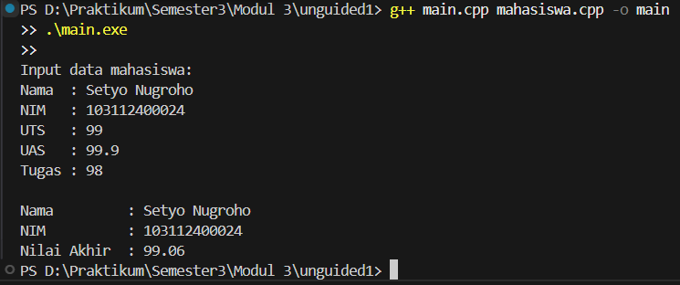

# <h1 align="center">LAPORAN PRAKTIKUM MODUL 3 <br> ABSTRACT DATA TYPE (ADT)</h1>
<p align="center">SETYO NUGROHO - 103112400024</p>

## Dasar Teori

### Abstract Data Type (ADT)
Abstract Data Type (ADT) adalah sebuah tipe data yang didefinisikan berdasarkan perilaku (behavior) dan operasi-operasi yang dapat dilakukan, bukan berdasarkan bagaimana data tersebut diimplementasikan.
Artinya, ADT berfokus pada apa yang dilakukan oleh suatu struktur data, bukan bagaimana cara melakukannya.

Dalam ADT, pengguna hanya perlu tahu fungsi-fungsi atau operasi yang disediakan, tanpa harus mengetahui detail implementasinya. Konsep ini membantu dalam menjaga abstraksi dan enkapsulasi, sehingga kode menjadi lebih mudah dipahami, digunakan, dan dikembangkan.

## Guided

### Guided 1

#### mahasiswa.h

```cpp
#ifndef MAHASISWA_H_INCLUDED
#define MAHASISWA_H_INCLUDED
struct mahasiswa
{
    char nim[10];
    int nilai1, nilai2;
};
void inputMhs(mahasiswa &m);
float rata2(mahasiswa m);
#endif
```

#### mahasiswa.cpp

```cpp
#include "mahasiswa.h"
#include <iostream>
using namespace std;

void inputMhs(mahasiswa &m)
{
    cout << "input nama = ";
    cin >> (m).nim;
    cout << "input nilai = ";
    cin >> (m).nilai1;
    cout << "input nilai2 = ";
    cin >> (m).nilai2;
}
float rata2(mahasiswa m)
{
    return float(m.nilai1 + m.nilai2) / 2;
}
```

#### main.cpp

```cpp
#include <iostream>
#include "mahasiswa.h"
using namespace std;

int main()
{
    mahasiswa mhs;
    inputMhs(mhs);
    cout << "rata - rata = " << rata2(mhs);
    return 0;
}
```

> Output
> 

Program ini menggunakan Abstract Data Type (ADT) berupa struct mahasiswa untuk menyimpan data NIM dan dua nilai.
Fungsi inputMhs() digunakan untuk memasukkan data mahasiswa, sedangkan rata2() menghitung rata-rata dari dua nilai tersebut.
Di fungsi main(), data dimasukkan lalu hasil rata-rata ditampilkan ke layar.
## Unguided

### Soal 1

Buat program yang dapat menyimpan data mahasiswa (max. 10) ke dalam sebuah array dengan field nama, nim, uts, uas, tugas, dan nilai akhir. Nilai akhir diperoleh dari FUNGSI dengan rumus 0.3*uts+0.4*uas+0.3*tugas.

#### unguided1.h

```cpp
#ifndef MAHASISWA_H_INCLUDED
#define MAHASISWA_H_INCLUDED

#include <iostream>
using namespace std;

struct Mahasiswa {
    string nama;
    string nim;
    float uts, uas, tugas;
};

float hitungNilaiAkhir(Mahasiswa mhs);

void inputData(Mahasiswa &mhs);
void tampilData(Mahasiswa mhs);

#endif
```

#### unguided1.cpp

```cpp
#include "mahasiswa.h"
#include <iostream>

float hitungNilaiAkhir(Mahasiswa mhs) {
    return (0.3 * mhs.uts) + (0.4 * mhs.uas) + (0.3 * mhs.tugas);
}

void inputData(Mahasiswa &mhs) {
    cout << "Nama  : ";
    getline(cin, mhs.nama);
    cout << "NIM   : ";
    getline(cin, mhs.nim);
    cout << "UTS   : ";
    cin >> mhs.uts;
    cout << "UAS   : ";
    cin >> mhs.uas;
    cout << "Tugas : ";
    cin >> mhs.tugas;
    cin.ignore();
}

void tampilData(Mahasiswa mhs) {
    cout << "\nNama         : " << mhs.nama << endl;
    cout << "NIM          : " << mhs.nim << endl;
    cout << "Nilai Akhir  : " << hitungNilaiAkhir(mhs) << endl;
}

```

#### main.cpp

```cpp
#include <iostream>
#include "mahasiswa.h"
using namespace std;

int main() {
    Mahasiswa mhs;
    cout << "Input data mahasiswa:\n";
    inputData(mhs);
    tampilData(mhs);
    return 0;
}

```

> Output
> 

Program ini menerapkan konsep Abstract Data Type (ADT) untuk menyimpan data mahasiswa yang terdiri dari nama, NIM, nilai UTS, UAS, dan tugas. Program menghitung nilai akhir menggunakan fungsi hitungNilaiAkhir dan menampilkan hasilnya dengan prosedur tampilData.

### Soal 2

> 

#### unguided2.h

```cpp
#ifndef PELAJARAN_H_INCLUDED
#define PELAJARAN_H_INCLUDED

#include <iostream>
using namespace std;

struct pelajaran {
    string namaMapel;
    string kodeMapel;
};
pelajaran create_pelajaran(string namapel, string kodepel);
void tampil_pelajaran(pelajaran pel);

#endif
```

#### unguided2.cpp

```cpp
#include "pelajaran.h"

pelajaran create_pelajaran(string namapel, string kodepel) {
    pelajaran pel;
    pel.namaMapel = namapel;
    pel.kodeMapel = kodepel;
    return pel;
}

void tampil_pelajaran(pelajaran pel) {
    cout << "Nama Mata Pelajaran : " << pel.namaMapel << endl;
    cout << "Kode Mata Pelajaran : " << pel.kodeMapel << endl;
}
```

#### main.cpp

```cpp
#include <iostream>
#include "pelajaran.h"
using namespace std;

int main() {
    string namapel = "Struktur Data";
    string kodepel = "STD";

    pelajaran pel = create_pelajaran(namapel, kodepel);
    tampil_pelajaran(pel);

    return 0;
}
```

> Output
> 

Program ini menggunakan ADT untuk merepresentasikan data pelajaran dengan atribut nama mata pelajaran dan kode pelajaran. Fungsi create_pelajaran digunakan untuk membuat data pelajaran baru, dan tampil_pelajaran untuk menampilkan informasi pelajaran tersebut.

### Soal 3

```
Buatlah program dengan ketentuan :
- 2 buah array 2D integer berukuran 3x3 dan 2 buah pointer integer
- fungsi/prosedur yang menampilkan isi sebuah array integer 2D
- fungsi/prosedur yang akan menukarkan isi dari 2 array integer 2D pada posisi tertentu
- fungsi/prosedur yang akan menukarkan isi dari variabel yang ditunjuk oleh 2 buah pointer
```

#### unguided3.h

```cpp
#ifndef ARRAY2D_H_INCLUDED
#define ARRAY2D_H_INCLUDED

#include <iostream>
using namespace std;

const int ROW = 3;
const int COL = 3;

void tampilArray(int arr[ROW][COL]);
void tukarElemen(int arr1[ROW][COL], int arr2[ROW][COL], int baris, int kolom);
void tukarPointer(int *a, int *b);

#endif
```

#### unguided3.cpp

```cpp
#include "array2d.h"
#include <iostream>

void tampilArray(int arr[ROW][COL]) {
    for (int i = 0; i < ROW; i++) {
        for (int j = 0; j < COL; j++) {
            cout << arr[i][j] << "\t";
        }
        cout << endl;
    }
}

void tukarElemen(int arr1[ROW][COL], int arr2[ROW][COL], int baris, int kolom) {
    int temp = arr1[baris][kolom];
    arr1[baris][kolom] = arr2[baris][kolom];
    arr2[baris][kolom] = temp;
}

void tukarPointer(int *a, int *b) {
    int temp = *a;
    *a = *b;
    *b = temp;
}

```

#### main.cpp

```cpp
#include <iostream>
#include "array2d.h"
using namespace std;

int main() {
    int A[ROW][COL] = {{1,2,3},{4,5,6},{7,8,9}};
    int B[ROW][COL] = {{9,8,7},{6,5,4},{3,2,1}};

    cout << "Array A awal:\n";
    tampilArray(A);

    cout << "\nArray B awal:\n";
    tampilArray(B);
    tukarElemen(A, B, 1, 1);

    cout << "\nSetelah tukar elemen posisi [1][1]:\n";
    cout << "Array A:\n";
    tampilArray(A);
    cout << "Array B:\n";
    tampilArray(B);

    int x = 10, y = 20;
    cout << "\nSebelum tukar pointer: x = " << x << ", y = " << y << endl;
    tukarPointer(&x, &y);
    cout << "Setelah tukar pointer: x = " << x << ", y = " << y << endl;

    return 0;
}

```

> Output
> 

Program ini mendemonstrasikan operasi dasar pada array dua dimensi dan pointer. Fungsi tampilArray digunakan untuk menampilkan isi array 3x3, tukarElemen untuk menukar elemen antara dua array, dan tukarPointer untuk menukar nilai dua variabel melalui pointer.

## Referensi

Modul 3: Abstract Data Type (ADT)

[W3school](https://www.w3school.com/cpp/) Diakses pada 13 Oktober 2025

[cplusplus](http://www.cplusplus.com/doc/tutorial/) Diakses pada 13 Oktober 2025
