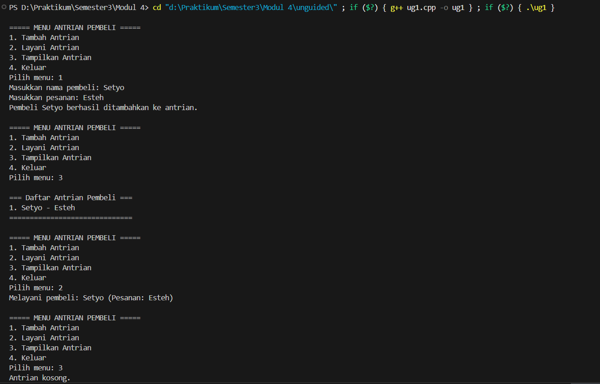
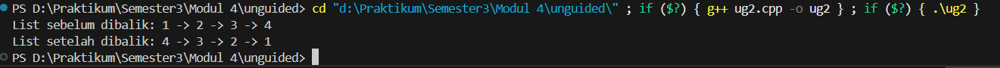

# <h1 align="center">LAPORAN PRAKTIKUM MODUL 4 <br> SINGLY LINKED LIST (BAGIAN PERTAMA)</h1>
<p align="center">SETYO NUGROHO - 103112400024</p>

## Dasar Teori

### Linked List

Singly Linked List adalah struktur data dinamis yang terdiri dari beberapa node yang saling terhubung lewat pointer.
Setiap node menyimpan data (info) dan penunjuk ke node berikutnya (next).
Linked list bersifat fleksibel karena bisa bertambah atau berkurang elemen tanpa harus menentukan ukuran awal seperti array.

## Guided

### Guided 1

#### linkedlist.cpp

```cpp
#include <iostream>
using namespace std;

// Struktur Node
struct Node {
    int data;
    Node* next;
};

// Pointer awal dan akhir
Node* head = nullptr;

// Fungsi untuk membuat node baru
Node* createNode(int data) {
    Node* newNode = new Node();
    newNode->data = data;
    newNode->next = nullptr;
    return newNode;
}

void insertDepan(int data) {
    Node* newNode = createNode(data);
    newNode->next = head;
    head = newNode;
    cout << "Data " << data << " berhasil ditambahkan di depan.\n";
}

void insertBelakang(int data) {
    Node* newNode = createNode(data);
    if (head == nullptr) {
        head = newNode;
    } else {
        Node* temp = head;
        while (temp->next != nullptr) {
            temp = temp->next;
        }
        temp->next = newNode;
    }
    cout << "Data " << data << " berhasil ditambahkan di belakang.\n";
}

void insertSetelah(int target, int dataBaru) {
    Node* temp = head;
    while (temp != nullptr && temp->data != target) {
        temp = temp->next;
    }

    if (temp == nullptr) {
        cout << "Data " << target << " tidak ditemukan!\n";
    } else {
        Node* newNode = createNode(dataBaru);
        newNode->next = temp->next;
        temp->next = newNode;
        cout << "Data " << dataBaru << " berhasil disisipkan setelah " << target << ".\n";
    }
}

// ========== DELETE FUNCTION ==========
void hapusNode(int data) {
    if (head == nullptr) {
        cout << "List kosong!\n";
        return;
    }

    Node* temp = head;
    Node* prev = nullptr;

    // Jika data di node pertama
    if (temp != nullptr && temp->data == data) {
        head = temp->next;
        delete temp;
        cout << "Data " << data << " berhasil dihapus.\n";
        return;
    }

    // Cari node yang akan dihapus
    while (temp != nullptr && temp->data != data) {
        prev = temp;
        temp = temp->next;
    }

    // Jika data tidak ditemukan
    if (temp == nullptr) {
        cout << "Data " << data << " tidak ditemukan!\n";
        return;
    }

    prev->next = temp->next;
    delete temp;
    cout << "Data " << data << " berhasil dihapus.\n";
}

// ========== UPDATE FUNCTION ==========
void updateNode(int dataLama, int dataBaru) {
    Node* temp = head;
    while (temp != nullptr && temp->data != dataLama) {
        temp = temp->next;
    }

    if (temp == nullptr) {
        cout << "Data " << dataLama << " tidak ditemukan!\n";
    } else {
        temp->data = dataBaru;
        cout << "Data " << dataLama << " berhasil diupdate menjadi " << dataBaru << ".\n";
    }
}

// ========== DISPLAY FUNCTION ==========
void tampilkanList() {
    if (head == nullptr) {
        cout << "List kosong!\n";
        return;
    }

    Node* temp = head;
    cout << "Isi Linked List: ";
    while (temp != nullptr) {
        cout << temp->data << " -> ";
        temp = temp->next;
    }
    cout << "NULL\n";
}

// ========== MAIN PROGRAM ==========
int main() {
    int pilihan, data, target, dataBaru;

    do {
        cout << "\n=== MENU SINGLE LINKED LIST ===\n";
        cout << "1. Insert Depan\n";
        cout << "2. Insert Belakang\n";
        cout << "3. Insert Setelah\n";
        cout << "4. Hapus Data\n";
        cout << "5. Update Data\n";
        cout << "6. Tampilkan List\n";
        cout << "0. Keluar\n";
        cout << "Pilih: ";
        cin >> pilihan;

        switch (pilihan) {
            case 1:
                cout << "Masukkan data: ";
                cin >> data;
                insertDepan(data);
                break;
            case 2:
                cout << "Masukkan data: ";
                cin >> data;
                insertBelakang(data);
                break;
            case 3:
                cout << "Masukkan data target: ";
                cin >> target;
                cout << "Masukkan data baru: ";
                cin >> dataBaru;
                insertSetelah(target, dataBaru);
                break;
            case 4:
                cout << "Masukkan data yang ingin dihapus: ";
                cin >> data;
                hapusNode(data);
                break;
            case 5:
                cout << "Masukkan data lama: ";
                cin >> data;
                cout << "Masukkan data baru: ";
                cin >> dataBaru;
                updateNode(data, dataBaru);
                break;
            case 6:
                tampilkanList();
                break;
            case 0:
                cout << "Program selesai.\n";
                break;
            default:
                cout << "Pilihan tidak valid!\n";
        }
    } while (pilihan != 0);

    return 0;
}
```

## Unguided

### Soal 1

buatlah single linked list untuk Antrian yang menyimpan data pembeli( nama dan pesanan). program memiliki beberapa menu seperti tambah antrian,  layani antrian(hapus), dan tampilkan antrian. \*antrian pertama harus yang pertama dilayani

```cpp
#include <iostream>
#include <string>
using namespace std;

struct Pembeli {
    string nama;
    string pesanan;
};

struct Node {
    Pembeli data;
    Node* next;
};

Node* head = nullptr;
Node* tail = nullptr;

Node* createNode(Pembeli data) {
    Node* newNode = new Node();
    newNode->data = data;
    newNode->next = nullptr;
    return newNode;
}

void tambahAntrian(Pembeli data) {
    Node* newNode = createNode(data);
    if (head == nullptr) {
        head = tail = newNode;
    } else {
        tail->next = newNode;
        tail = newNode;
    }
    cout << "Pembeli " << data.nama << " berhasil ditambahkan ke antrian.\n";
}

void layaniAntrian() {
    if (head == nullptr) {
        cout << "Antrian kosong, tidak ada yang bisa dilayani.\n";
        return;
    }
    Node* temp = head;
    cout << "Melayani pembeli: " << head->data.nama 
         << " (Pesanan: " << head->data.pesanan << ")\n";
    head = head->next;
    delete temp;
    if (head == nullptr) tail = nullptr;
}

void tampilAntrian() {
    if (head == nullptr) {
        cout << "Antrian kosong.\n";
        return;
    }
    cout << "\n=== Daftar Antrian Pembeli ===\n";
    Node* current = head;
    int i = 1;
    while (current != nullptr) {
        cout << i++ << ". " << current->data.nama 
             << " - " << current->data.pesanan << endl;
        current = current->next;
    }
    cout << "==============================\n";
}

int main() {
    int pilihan;
    do {
        cout << "\n===== MENU ANTRIAN PEMBELI =====\n";
        cout << "1. Tambah Antrian\n";
        cout << "2. Layani Antrian\n";
        cout << "3. Tampilkan Antrian\n";
        cout << "4. Keluar\n";
        cout << "Pilih menu: ";
        cin >> pilihan;
        cin.ignore();

        if (pilihan == 1) {
            Pembeli p;
            cout << "Masukkan nama pembeli: ";
            getline(cin, p.nama);
            cout << "Masukkan pesanan: ";
            getline(cin, p.pesanan);
            tambahAntrian(p);
        } else if (pilihan == 2) {
            layaniAntrian();
        } else if (pilihan == 3) {
            tampilAntrian();
        } else if (pilihan == 4) {
            cout << "Keluar dari program.\n";
        } else {
            cout << "Pilihan tidak valid!\n";
        }

    } while (pilihan != 4);

    return 0;
}
```

> Output
> 

Program ini menggunakan struktur data Singly Linked List untuk mensimulasikan antrian pembeli pada suatu tempat makan.
Setiap pembeli memiliki nama dan pesanan, yang disimpan dalam node linked list.
Antrian bersifat FIFO (First In, First Out), artinya pembeli yang pertama masuk akan menjadi yang pertama dilayani.

Program memiliki tiga fitur utama:
Tambah Antrian – menambahkan data pembeli baru ke akhir antrian.
Layani Antrian – menghapus pembeli pertama dari antrian (dilayani).
Tampilkan Antrian – menampilkan seluruh daftar pembeli yang sedang menunggu.
Struktur list bersifat dinamis, sehingga jumlah antrian dapat bertambah dan berkurang sesuai kebutuhan tanpa batasan ukuran.

### Soal 2

buatlah program kode untuk membalik (reverse) singly linked list (1-2-3 menjadi 3-2-1) 

```cpp
#include <iostream>
using namespace std;

struct Node {
    int data;
    Node* next;
};

Node* head = nullptr;

void tambahNode(int nilai) {
    Node* newNode = new Node();
    newNode->data = nilai;
    newNode->next = nullptr;

    if (head == nullptr) {
        head = newNode;
    } else {
        Node* temp = head;
        while (temp->next != nullptr) {
            temp = temp->next;
        }
        temp->next = newNode;
    }
}

void tampilList() {
    Node* temp = head;
    if (temp == nullptr) {
        cout << "List kosong\n";
        return;
    }
    while (temp != nullptr) {
        cout << temp->data;
        if (temp->next != nullptr) cout << " -> ";
        temp = temp->next;
    }
    cout << endl;
}

void reverseList() {
    Node* prev = nullptr;
    Node* current = head;
    Node* next = nullptr;

    while (current != nullptr) {
        next = current->next;
        current->next = prev;
        prev = current;
        current = next;
    }
    head = prev;
}
int main() {
    tambahNode(1);
    tambahNode(2);
    tambahNode(3);
    tambahNode(4);

    cout << "List sebelum dibalik: ";
    tampilList();

    reverseList();

    cout << "List setelah dibalik: ";
    tampilList();

    return 0;
}

```

> Output
> 

Program ini menggunakan struktur data singly linked list untuk menyimpan dan membalik urutan data. Setiap node menyimpan nilai integer dan pointer ke node berikutnya. Data awal dimasukkan ke dalam linked list secara berurutan (misalnya 1 → 2 → 3 → 4).

Kemudian program menggunakan algoritma pembalikan pointer untuk membalik arah hubungan antar-node, sehingga urutan data menjadi terbalik (4 → 3 → 2 → 1).
Program juga menampilkan linked list sebelum dan sesudah dibalik agar hasilnya dapat terlihat jelas.

## Referensi

Modul 4: Singly Linked List (Bagian Pertama)


