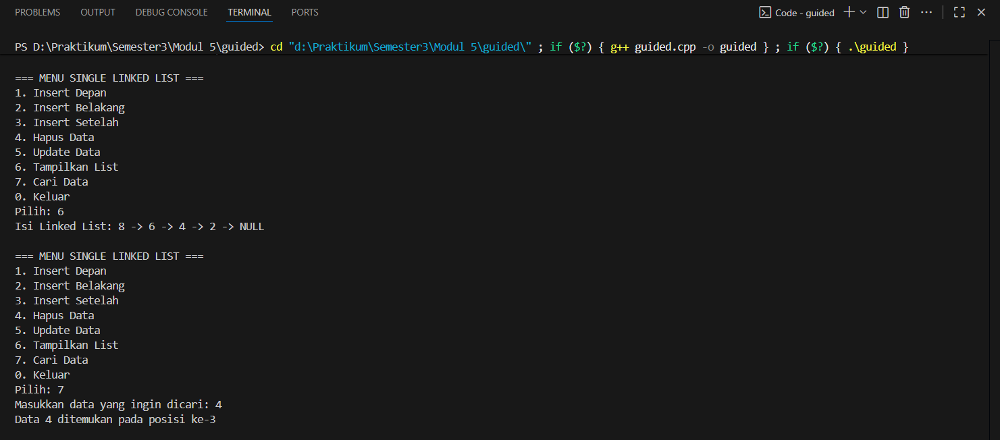
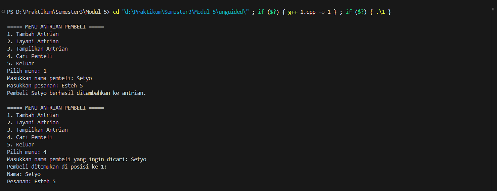
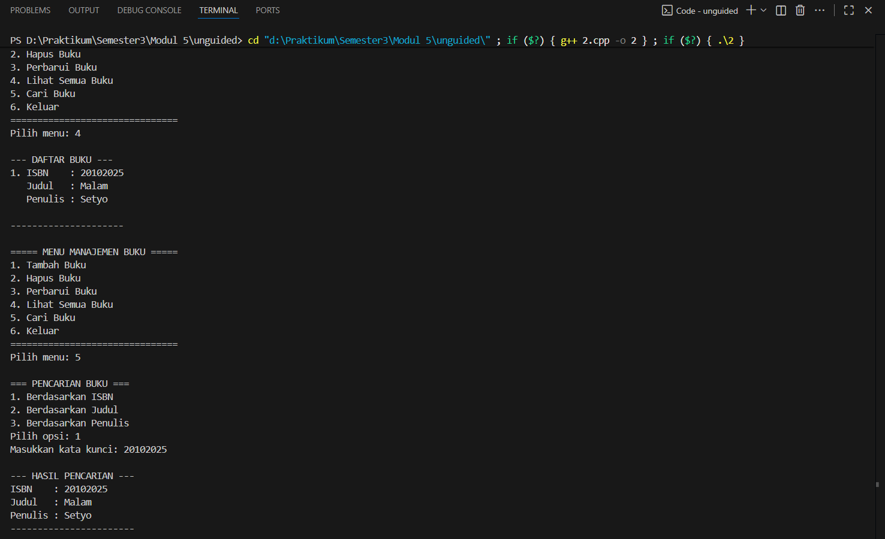

# <h1 align="center">LAPORAN PRAKTIKUM MODUL 5 <br> SINGLY LINKED LIST (BAGIAN KEDUA)</h1>
<p align="center">SETYO NUGROHO - 103112400024</p>

## Dasar Teori

### Linked List

Linked List adalah struktur data dinamis yang terdiri dari elemen-elemen yang disebut node, di mana setiap node berisi data dan pointer yang menunjuk ke node berikutnya.
Berbeda dengan array yang memiliki ukuran tetap, linked list dapat bertambah atau berkurang sesuai kebutuhan program (dynamic memory allocation).

Singly Linked List adalah struktur data dinamis yang terdiri dari beberapa node yang saling terhubung lewat pointer. Setiap node menyimpan data (info) dan penunjuk ke node berikutnya (next). Linked list bersifat fleksibel karena bisa bertambah atau berkurang elemen tanpa harus menentukan ukuran awal seperti array.

## Guided

### Guided 1

#### linkedlist.cpp

```cpp
#include <iostream>
using namespace std;

struct Node {
    int data;
    Node* next;
};

Node* head = nullptr;

Node* createNode(int data) {
    Node* newNode = new Node();
    newNode->data = data;
    newNode->next = nullptr;
    return newNode;
}

void insertDepan(int data) {
    Node* newNode = createNode(data);
    newNode->next = head;
    head = newNode;
    cout << "Data " << data << " berhasil ditambahkan di depan.\n";
}

void insertBelakang(int data) {
    Node* newNode = createNode(data);
    if (head == nullptr) {
        head = newNode;
    } else {
        Node* temp = head;
        while (temp->next != nullptr) {
            temp = temp->next;
        }
        temp->next = newNode;
    }
    cout << "Data " << data << " berhasil ditambahkan di belakang.\n";
}

void insertSetelah(int target, int dataBaru) {
    Node* temp = head;
    while (temp != nullptr && temp->data != target) {
        temp = temp->next;
    }

    if (temp == nullptr) {
        cout << "Data " << target << " tidak ditemukan!\n";
    } else {
        Node* newNode = createNode(dataBaru);
        newNode->next = temp->next;
        temp->next = newNode;
        cout << "Data " << dataBaru << " berhasil disisipkan setelah " << target << ".\n";
    }
}

void hapusNode(int data) {
    if (head == nullptr) {
        cout << "List kosong!\n";
        return;
    }

    Node* temp = head;
    Node* prev = nullptr;

    if (temp != nullptr && temp->data == data) {
        head = temp->next;
        delete temp;
        cout << "Data " << data << " berhasil dihapus.\n";
        return;
    }

    while (temp != nullptr && temp->data != data) {
        prev = temp;
        temp = temp->next;
    }

    if (temp == nullptr) {
        cout << "Data " << data << " tidak ditemukan!\n";
        return;
    }

    prev->next = temp->next;
    delete temp;
    cout << "Data " << data << " berhasil dihapus.\n";
}

void updateNode(int dataLama, int dataBaru) {
    Node* temp = head;
    while (temp != nullptr && temp->data != dataLama) {
        temp = temp->next;
    }

    if (temp == nullptr) {
        cout << "Data " << dataLama << " tidak ditemukan!\n";
    } else {
        temp->data = dataBaru;
        cout << "Data " << dataLama << " berhasil diupdate menjadi " << dataBaru << ".\n";
    }
}

void tampilkanList() {
    if (head == nullptr) {
        cout << "List kosong!\n";
        return;
    }

    Node* temp = head;
    cout << "Isi Linked List: ";
    while (temp != nullptr) {
        cout << temp->data << " -> ";
        temp = temp->next;
    }
    cout << "NULL\n";
}

void searchData(int key) {
    Node* temp = head;
    int pos = 1;
    bool found = false;

    if (head == nullptr) {
        cout << "List kosong! Tidak ada data yang bisa dicari.\n";
        return;
    }

    while (temp != nullptr) {
        if (temp->data == key) {
            cout << "Data " << key << " ditemukan pada posisi ke-" << pos << endl;
            found = true;
            break;
        }
        temp = temp->next;
        pos++;
    }

    if (!found) {
        cout << "Data " << key << " tidak ditemukan dalam list.\n";
    }
}

int main() {
    int pilihan, data, target, dataBaru;

    do {
        cout << "\n=== MENU SINGLE LINKED LIST ===\n";
        cout << "1. Insert Depan\n";
        cout << "2. Insert Belakang\n";
        cout << "3. Insert Setelah\n";
        cout << "4. Hapus Data\n";
        cout << "5. Update Data\n";
        cout << "6. Tampilkan List\n";
        cout << "7. Cari Data\n";
        cout << "0. Keluar\n";
        cout << "Pilih: ";
        cin >> pilihan;

        switch (pilihan) {
            case 1:
                cout << "Masukkan data: ";
                cin >> data;
                insertDepan(data);
                break;
            case 2:
                cout << "Masukkan data: ";
                cin >> data;
                insertBelakang(data);
                break;
            case 3:
                cout << "Masukkan data target: ";
                cin >> target;
                cout << "Masukkan data baru: ";
                cin >> dataBaru;
                insertSetelah(target, dataBaru);
                break;
            case 4:
                cout << "Masukkan data yang ingin dihapus: ";
                cin >> data;
                hapusNode(data);
                break;
            case 5:
                cout << "Masukkan data lama: ";
                cin >> data;
                cout << "Masukkan data baru: ";
                cin >> dataBaru;
                updateNode(data, dataBaru);
                break;
            case 6:
                tampilkanList();
                break;
            case 7:
                cout << "Masukkan data yang ingin dicari: ";
                cin >> data;
                searchData(data);
                break;
            case 0:
                cout << "Program selesai. Sampai jumpa! 👋\n";
                break;
            default:
                cout << "Pilihan tidak valid!\n";
        }
    } while (pilihan != 0);

    return 0;
}
```

> Output
> 

Program ini menerapkan Singly Linked List untuk mengelola data secara dinamis.
Setiap node berisi nilai bertipe int dan pointer ke node berikutnya.
Program menyediakan menu interaktif yang memungkinkan pengguna untuk menambah data di depan atau belakang, menyisipkan data setelah node tertentu, menghapus data, mengubah data, menampilkan seluruh isi list, serta mencari data tertentu di dalam list.
Tujuannya adalah agar pengguna memahami konsep dasar manipulasi data menggunakan pointer dalam struktur data linked list.

## Unguided

### Soal 1

buatlah searcing untuk mencari nama pembeli pada unguided sebelumnya

```cpp
#include <iostream>
#include <string>
using namespace std;

struct Pembeli {
    string nama;
    string pesanan;
};

struct Node {
    Pembeli data;
    Node* next;
};

Node* head = nullptr;
Node* tail = nullptr;

Node* createNode(Pembeli data) {
    Node* newNode = new Node();
    newNode->data = data;
    newNode->next = nullptr;
    return newNode;
}

void tambahAntrian(Pembeli data) {
    Node* newNode = createNode(data);
    if (head == nullptr) {
        head = tail = newNode;
    } else {
        tail->next = newNode;
        tail = newNode;
    }
    cout << "Pembeli " << data.nama << " berhasil ditambahkan ke antrian.\n";
}

void layaniAntrian() {
    if (head == nullptr) {
        cout << "Antrian kosong, tidak ada yang bisa dilayani.\n";
        return;
    }
    Node* temp = head;
    cout << "Melayani pembeli: " << head->data.nama 
         << " (Pesanan: " << head->data.pesanan << ")\n";
    head = head->next;
    delete temp;
    if (head == nullptr) tail = nullptr;
}

void tampilAntrian() {
    if (head == nullptr) {
        cout << "Antrian kosong.\n";
        return;
    }
    cout << "\n=== Daftar Antrian Pembeli ===\n";
    Node* current = head;
    int i = 1;
    while (current != nullptr) {
        cout << i++ << ". " << current->data.nama 
             << " - " << current->data.pesanan << endl;
        current = current->next;
    }
    cout << "==============================\n";
}

void cariPembeli(const string& namaCari) {
    if (head == nullptr) {
        cout << "Antrian kosong, tidak ada data untuk dicari.\n";
        return;
    }

    Node* current = head;
    bool ditemukan = false;
    int posisi = 1;

    while (current != nullptr) {
        if (current->data.nama == namaCari) {
            cout << "Pembeli ditemukan di posisi ke-" << posisi << ":\n";
            cout << "Nama: " << current->data.nama << endl;
            cout << "Pesanan: " << current->data.pesanan << endl;
            ditemukan = true;
            break;
        }
        current = current->next;
        posisi++;
    }

    if (!ditemukan) {
        cout << "Pembeli dengan nama \"" << namaCari << "\" tidak ditemukan.\n";
    }
}

int main() {
    int pilihan;
    do {
        cout << "\n===== MENU ANTRIAN PEMBELI =====\n";
        cout << "1. Tambah Antrian\n";
        cout << "2. Layani Antrian\n";
        cout << "3. Tampilkan Antrian\n";
        cout << "4. Cari Pembeli\n";
        cout << "5. Keluar\n";
        cout << "Pilih menu: ";
        cin >> pilihan;
        cin.ignore();

        if (pilihan == 1) {
            Pembeli p;
            cout << "Masukkan nama pembeli: ";
            getline(cin, p.nama);
            cout << "Masukkan pesanan: ";
            getline(cin, p.pesanan);
            tambahAntrian(p);
        } 
        else if (pilihan == 2) {
            layaniAntrian();
        } 
        else if (pilihan == 3) {
            tampilAntrian();
        } 
        else if (pilihan == 4) {
            string namaCari;
            cout << "Masukkan nama pembeli yang ingin dicari: ";
            getline(cin, namaCari);
            cariPembeli(namaCari);
        }
        else if (pilihan == 5) {
            cout << "Keluar dari program.\n";
        } 
        else {
            cout << "Pilihan tidak valid!\n";
        }

    } while (pilihan != 5);

    return 0;
}

```

> Output
> 

Program ini mensimulasikan sistem antrian pembeli menggunakan konsep Singly Linked List.
Setiap node menyimpan data pembeli berupa nama dan pesanan.
Melalui menu yang tersedia, pengguna dapat menambah pembeli ke antrian, melayani pembeli paling depan (menghapus dari list), menampilkan seluruh antrian, dan mencari pembeli berdasarkan nama.
Program ini menggambarkan cara kerja antrian dengan prinsip FIFO (First In, First Out) serta menunjukkan bagaimana linked list bisa digunakan dalam sistem layanan nyata seperti kasir atau loket.

### Soal 2

gunakan latihan pada pertemuan minggun ini dan tambahkan seardhing untuk mencari buku berdasarkan judul, penulis, dan ISBN

```cpp
#include <iostream>
#include <string>
using namespace std;

struct Node {
    string isbn, judul, penulis;
    Node* next;
};

Node* head = NULL;

void tambahBuku() {
    Node* newNode = new Node();
    cout << "Masukkan ISBN: ";
    getline(cin >> ws, newNode->isbn);
    cout << "Masukkan Judul: ";
    getline(cin, newNode->judul);
    cout << "Masukkan Penulis: ";
    getline(cin, newNode->penulis);
    newNode->next = NULL;

    if (head == NULL) {
        head = newNode;
    } else {
        Node* temp = head;
        while (temp->next != NULL) {
            temp = temp->next;
        }
        temp->next = newNode;
    }
    cout << "\n>> Buku berhasil ditambahkan!\n";
}

void lihatBuku() {
    if (head == NULL) {
        cout << "\n>> List buku masih kosong.\n";
        return;
    }

    Node* temp = head;
    int nomor = 1;
    cout << "\n--- DAFTAR BUKU ---\n";
    while (temp != NULL) {
        cout << nomor++ << ". ISBN    : " << temp->isbn << endl;
        cout << "   Judul   : " << temp->judul << endl;
        cout << "   Penulis : " << temp->penulis << endl << endl;
        temp = temp->next;
    }
    cout << "---------------------\n";
}

void hapusBuku() {
    if (head == NULL) {
        cout << "\n>> List buku kosong, tidak ada yang bisa dihapus.\n";
        return;
    }

    string isbnTarget;
    cout << "Masukkan ISBN buku yang akan dihapus: ";
    getline(cin >> ws, isbnTarget);

    Node* current = head;
    Node* prev = NULL;

    while (current != NULL && current->isbn != isbnTarget) {
        prev = current;
        current = current->next;
    }

    if (current == NULL) {
        cout << "\n>> Buku dengan ISBN " << isbnTarget << " tidak ditemukan.\n";
        return;
    }

    if (prev == NULL) {
        head = current->next;
    } else {
        prev->next = current->next;
    }

    delete current;
    cout << "\n>> Buku berhasil dihapus.\n";
}

void perbaruiBuku() {
    if (head == NULL) {
        cout << "\n>> List buku kosong.\n";
        return;
    }

    string isbnTarget;
    cout << "Masukkan ISBN buku yang akan diperbarui: ";
    getline(cin >> ws, isbnTarget);

    Node* current = head;
    while (current != NULL) {
        if (current->isbn == isbnTarget) {
            cout << "Masukkan Judul baru: ";
            getline(cin, current->judul);
            cout << "Masukkan Penulis baru: ";
            getline(cin, current->penulis);
            cout << "\n>> Data buku berhasil diperbarui!\n";
            return;
        }
        current = current->next;
    }

    cout << "\n>> Buku dengan ISBN " << isbnTarget << " tidak ditemukan.\n";
}

void cariBuku() {
    if (head == NULL) {
        cout << "\n>> List buku masih kosong.\n";
        return;
    }

    int opsi;
    cout << "\n=== PENCARIAN BUKU ===\n";
    cout << "1. Berdasarkan ISBN\n";
    cout << "2. Berdasarkan Judul\n";
    cout << "3. Berdasarkan Penulis\n";
    cout << "Pilih opsi: ";
    cin >> opsi;
    cin.ignore();

    string keyword;
    cout << "Masukkan kata kunci: ";
    getline(cin, keyword);

    Node* temp = head;
    bool ditemukan = false;

    cout << "\n--- HASIL PENCARIAN ---\n";
    while (temp != NULL) {
        bool cocok = false;
        switch (opsi) {
            case 1: cocok = (temp->isbn == keyword); break;
            case 2: cocok = (temp->judul == keyword); break;
            case 3: cocok = (temp->penulis == keyword); break;
            default:
                cout << "Pilihan tidak valid!\n";
                return;
        }

        if (cocok) {
            cout << "ISBN    : " << temp->isbn << endl;
            cout << "Judul   : " << temp->judul << endl;
            cout << "Penulis : " << temp->penulis << endl;
            cout << "-----------------------\n";
            ditemukan = true;
        }

        temp = temp->next;
    }

    if (!ditemukan) {
        cout << ">> Buku tidak ditemukan.\n";
    }
}

int main() {
    int pilihan;
    do {
        cout << "\n===== MENU MANAJEMEN BUKU =====\n"
             << "1. Tambah Buku\n"
             << "2. Hapus Buku\n"
             << "3. Perbarui Buku\n"
             << "4. Lihat Semua Buku\n"
             << "5. Cari Buku\n"
             << "6. Keluar\n"
             << "===============================\n"
             << "Pilih menu: ";
        cin >> pilihan;

        switch (pilihan) {
            case 1: tambahBuku(); break;
            case 2: hapusBuku(); break;
            case 3: perbaruiBuku(); break;
            case 4: lihatBuku(); break;
            case 5: cariBuku(); break;
            case 6: cout << "Terima kasih!\n"; break;
            default: cout << "Pilihan tidak valid!\n"; break;
        }
    } while (pilihan != 6);

    return 0;
}

```

> Output
> 

Program ini berfungsi sebagai sistem manajemen data buku berbasis Singly Linked List.
Setiap node menyimpan informasi buku yang terdiri dari ISBN, judul, dan penulis.
Program memiliki fitur untuk menambahkan buku baru, menghapus data berdasarkan ISBN, memperbarui data buku, menampilkan seluruh daftar buku, dan mencari buku berdasarkan ISBN, judul, atau penulis.
Dengan program ini, pengguna dapat memahami bagaimana linked list digunakan dalam pengelolaan data yang bersifat dinamis tanpa batas ukuran tetap seperti array.

## Referensi

Modul 5: Singly Linked List (Bagian Kedua)

http://www.cplusplus.com/doc/tutorial/ Diakses pada 20 Oktober 2025

https://www.w3school.com/cpp/ Diakses pada 20 Oktober 2025


