# <h1 align="center">Laporan Praktikum Modul 1 <br> Pengenalan Bahasa C++</h1>
<p align="center">SETYO NUGROHO - 103112400024</p>

## Dasar Teori

Pemrograman C++ merupakan bahasa pemrograman yang mendukung paradigma prosedural dan berorientasi objek. Bahasa ini banyak digunakan untuk mempelajari dasar-dasar algoritma karena strukturnya yang jelas serta mendukung berbagai tipe data, operator, perulangan, dan percabangan.
Dalam pembuatan program, terdapat beberapa konsep dasar yang sering digunakan:

#### Variabel dan Tipe Data
Variabel digunakan untuk menyimpan nilai, sedangkan tipe data menentukan jenis nilai yang disimpan, seperti int untuk bilangan bulat, float/double untuk bilangan desimal, dan char untuk karakter.

#### Input dan Output
C++ menggunakan cin untuk input dan cout untuk output. Library <iostream> dibutuhkan agar program bisa menerima dan menampilkan data.

#### Operator
Operator digunakan untuk melakukan operasi terhadap variabel atau nilai. Misalnya +, -, *, /, dan % (modulus).

#### Percabangan
Digunakan untuk mengambil keputusan berdasarkan kondisi tertentu. Contoh: if, if-else, dan switch.

#### Perulangan
Digunakan untuk mengulang eksekusi perintah tertentu, seperti for, while, dan do-while. Perulangan ini memudahkan pembuatan pola atau perhitungan yang berulang.

#### Fungsi
Fungsi digunakan untuk memecah program menjadi bagian-bagian kecil agar lebih terstruktur dan mudah dipahami.

## Guided

### Aritmatika

```cpp
#include <iostream>
using namespace std;
int main()
{
    int W, X, Y;
    float Z;
    X = 7;
    Y = 3;
    W = 1;
    Z = (X + Y) / (Y + W);
    cout << "Nilai z = " << Z << endl;
    return 0;
}
```
> Output
> 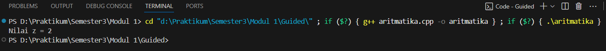

Program ini melakukan operasi aritmetika sederhana dengan variabel X, Y, W, dan Z. Rumus (X + Y) / (Y + W) dihitung lalu hasilnya ditampilkan ke layar.

### Fungsi

```cpp
#include <iostream>
using namespace std;

// Prosedur: hanya menampilkan hasil, tidak mengembalikan nilai
void tampilkanHasil(double p, double l)
{
    cout << "\n=== Hasil Perhitungan ===" << endl;
    cout << "Panjang : " << p << endl;
    cout << "Lebar   : " << l << endl;
    cout << "Luas    : " << p * l << endl;
    cout << "Keliling: " << 2 * (p + l) << endl;
}

// Fungsi: mengembalikan nilai luas
double hitungLuas(double p, double l)
{
    return p * l;
}

// Fungsi: mengembalikan nilai keliling
double hitungKeliling(double p, double l)
{
    return 2 * (p + l);
}

int main()
{
    double panjang, lebar;

    cout << "Masukkan panjang: ";
    cin >> panjang;
    cout << "Masukkan lebar  : ";
    cin >> lebar;

    // Panggil fungsi
    double luas = hitungLuas(panjang, lebar);
    double keliling = hitungKeliling(panjang, lebar);

    cout << "\nDihitung dengan fungsi:" << endl;
    cout << "Luas      = " << luas << endl;
    cout << "Keliling  = " << keliling << endl;

    // Panggil prosedur
    tampilkanHasil(panjang, lebar);

    return 0;
}
```

> Output
> 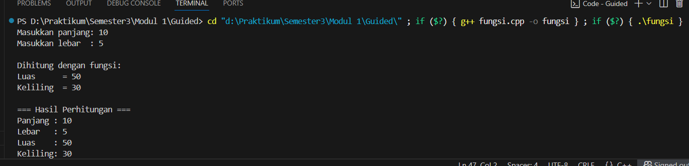

Program ini menggunakan fungsi dan prosedur untuk menghitung serta menampilkan luas dan keliling persegi panjang. Input berupa panjang dan lebar, kemudian hasilnya ditampilkan dengan dua cara: lewat fungsi yang mengembalikan nilai dan prosedur yang langsung mencetak hasil.

### Kondisi

```cpp
#include <iostream>
using namespace std;
// int main()
// {
//     double tot_pembelian, diskon;
//     cout << "total pembelian: Rp";
//     cin >> tot_pembelian;
//     diskon = 0;
//     if (tot_pembelian >= 100000)
//         diskon = 0.05 * tot_pembelian;
//     cout << "besar diskon = Rp" << diskon;
// }

// int main()
// {
//     double tot_pembelian, diskon;
//     cout << "total pembelian: Rp";
//     cin >> tot_pembelian;
//     diskon = 0;
//     if (tot_pembelian >= 100000)
//         diskon = 0.05 * tot_pembelian;
//     else
//         diskon = 0;
//     cout << "besar diskon = Rp" << diskon;
// }

int main()
{
    int kode_hari;
    cout << "Menentukan hari kerja/libur\n"<<endl;
    cout << "1=Senin 3=Rabu 5=Jumat 7=Minggu "<<endl;
    cout << "2=Selasa 4=Kamis 6=Sabtu "<<endl;
    cin >> kode_hari;
    switch (kode_hari)
    {
    case 1:
    case 2:
    case 3:
    case 4:
    case 5:
        cout<<"Hari Kerja";
        break;
    case 6:
    case 7:
        cout<<"Hari Libur";
        break;
    default:
        cout<<"Kode masukan salah!!!";
    }
    return 0;
}
```

> Output
> 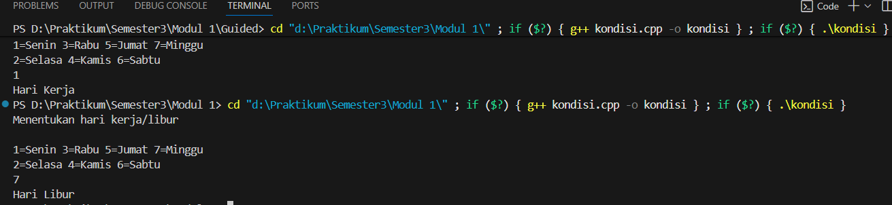

Program ini menerapkan percabangan dengan if-else dan switch. Contoh yang dipakai adalah menentukan diskon pembelian serta menentukan apakah suatu hari termasuk hari kerja atau hari libur berdasarkan kode yang dimasukkan.

### Perulangan

```cpp
#include <iostream>
using namespace std;
// int main()
// {
//     int jum;
//     cout << "jumlah perulangan: ";
//     cin >> jum;
//     for (int i = 0; i < jum; i++)
//     {
//         cout << "saya sahroni\n";
//     }
//     return 1;
// }

// while
int main()
{
    int i = 1;
    int jum;
    cin >> jum;
    do
    {
        cout << "bahlil ke-" << (i + 1) << endl;
        i++;
    } while (i < jum);
    return 0;
}
```

> Output
> 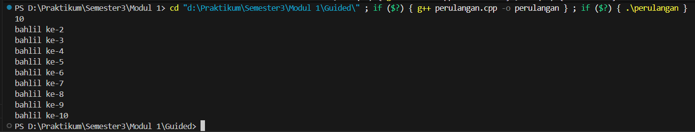

Program ini menunjukkan penggunaan perulangan dengan for, while, dan do-while. Output berupa teks yang berulang sesuai jumlah perulangan yang dimasukkan user.

### Struct

```cpp
#include <iostream>
#include <string>
using namespace std;

// Definisi struct
struct Mahasiswa {
    string nama;
    string nim;
    float ipk;
};

int main() {

    Mahasiswa mhs1;

    cout << "Masukkan Nama Mahasiswa: ";
    getline(cin, mhs1.nama);
    // cin >> mhs1.nama;
    cout << "Masukkan NIM Mahasiswa : ";
    cin >> mhs1.nim;
    cout << "Masukkan IPK Mahasiswa : ";
    cin >> mhs1.ipk;

    cout << "\n=== Data Mahasiswa ===" << endl;
    cout << "Nama : " << mhs1.nama << endl;
    cout << "NIM  : " << mhs1.nim << endl;
    cout << "IPK  : " << mhs1.ipk << endl;

    return 0;
}
```

> Output
> 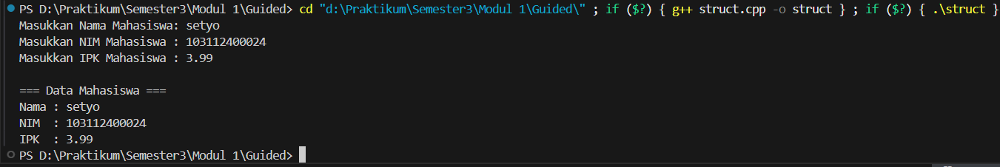

Program ini menggunakan struct untuk menyimpan data mahasiswa (nama, NIM, dan IPK). Data dimasukkan melalui input, lalu ditampilkan kembali sebagai output.

### Test

```cpp
#include <iostream>
using namespace std;
int main()
{
    string ch;
    cout << "Masukkan sebuah karakter: ";
    // cin >> ch;
    ch = getchar();  //Menggunakan getchar() untuk membaca satu karakter
    cout << "Karakter yang Anda masukkan adalah: " << ch << endl;
    return 0;
}
```

> Output
> 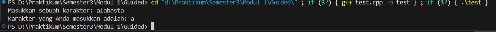

Program ini menggunakan getchar() untuk membaca satu karakter dari input, lalu menampilkannya kembali ke layar. Tujuannya memperlihatkan cara membaca input karakter tunggal.

## Unguided

### Soal 1

> 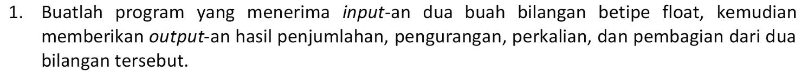

```cpp
#include <iostream>
using namespace std;

int main() {
    float a, b;
    cout << "Masukkan bilangan pertama: ";
    cin >> a;
    cout << "Masukkan bilangan kedua: ";
    cin >> b;

    cout << "Penjumlahan: " << a + b << endl;
    cout << "Pengurangan: " << a - b << endl;
    cout << "Perkalian: " << a * b << endl;
    cout << "Pembagian: " << a / b << endl;

    return 0;
}
```

> Output
> 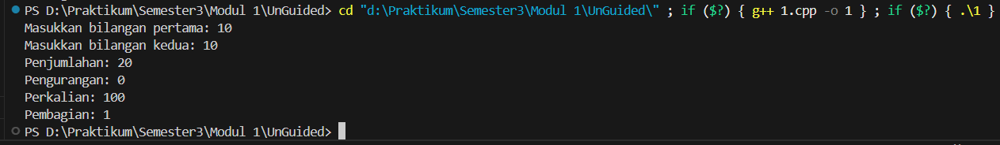

Program ini meminta user memasukkan dua bilangan, lalu menampilkan hasil dari operasi aritmatika dasar: penjumlahan, pengurangan, perkalian, dan pembagian.

### Soal 2

> 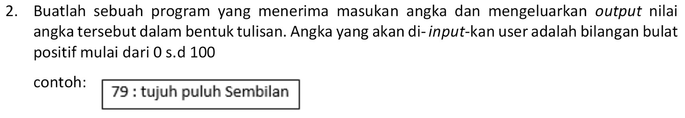

```cpp
#include <iostream>
using namespace std;

string lancelot(int n) {
    string angka[] = {"nol","satu","dua","tiga","empat","lima","enam","tujuh","delapan","sembilan"};

    if (n == 100) return "seratus";
    if (n < 10) return angka[n];
    if (n == 10) return "sepuluh";
    if (n == 11) return "sebelas";
    if (n < 20) return angka[n % 10] + " belas";

    string hasil = angka[n / 10] + string(" puluh");
    if (n % 10 != 0) hasil += " " + angka[n % 10];
    return hasil;
}

int main() {
    int x;
    cout << "Masukkan angka (0-100): ";
    cin >> x;

    if (x < 0 || x > 100) {
        cout << "Input harus 0 - 100!" << endl;
    } else {
        cout << x << " : " << lancelot(x) << endl;
    }
    return 0;
}

```

> Output
> 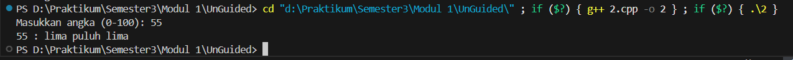

Program ini mengubah angka (0–100) menjadi tulisan dalam bahasa Indonesia. Misalnya, input 15 akan jadi “lima belas”, input 40 jadi “empat puluh”, dan seterusnya.

### Soal 3

> 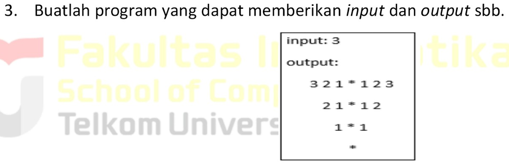

```cpp
#include <iostream>
using namespace std;

int main() {
    int esteh;
    cout << "input: ";
    cin >> esteh;
    cout << "output:" << endl;

    for (int i = esteh; i >= 1; i--) {
        for (int s = 0; s < esteh - i; s++) {
            cout << "  "; 
        }
        for (int j = i; j >= 1; j--) {
            cout << j << " ";
        }
        cout << "* ";
        for (int j = 1; j <= i; j++) {
            cout << j << " ";
        }
        cout << endl;
    }

    for (int s = 0; s < esteh; s++) cout << "  ";
    cout << "*" << endl;

    return 0;
}
```

> Output
> 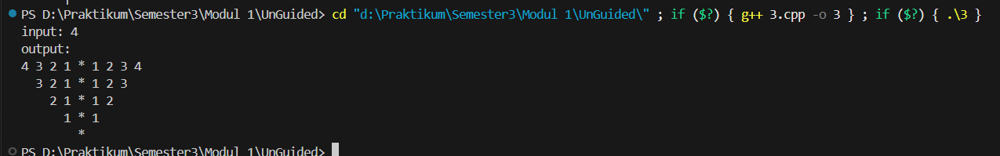

Program ini menerima sebuah angka lalu menampilkan pola berbentuk segitiga menurun. Polanya terdiri dari deretan angka menurun dan naik dengan tanda * di tengahnya.

### Referensi

http://www.cplusplus.com/doc/tutorial/

https://www.w3schools.com/CPP/


