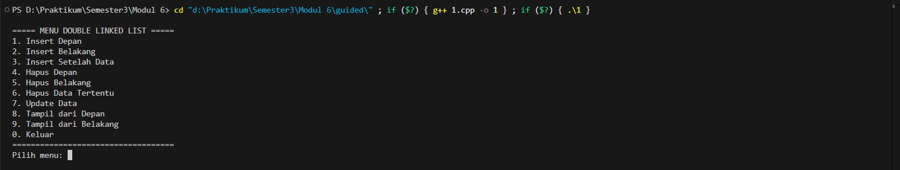
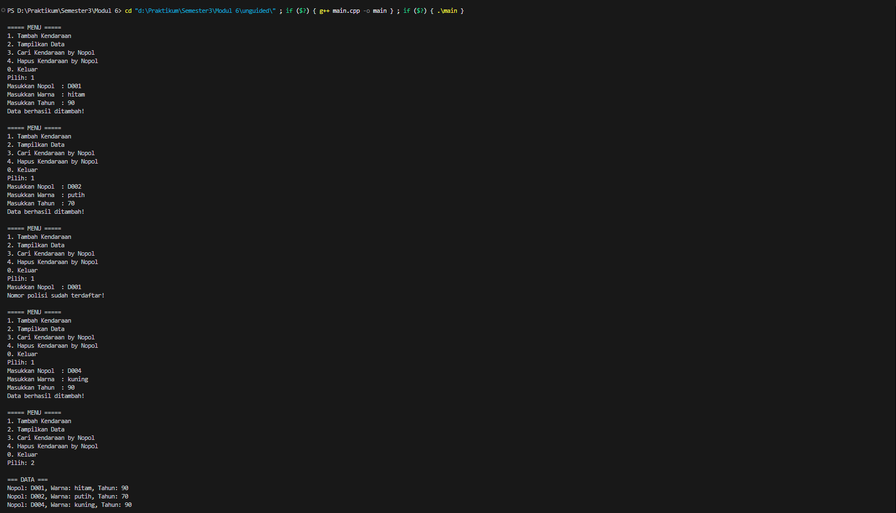
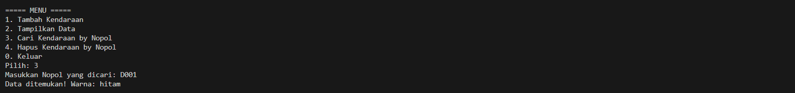
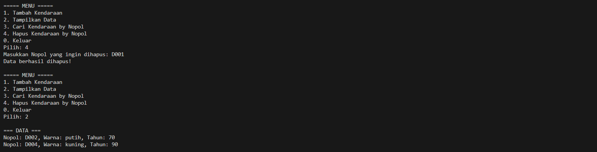

# <h1 align="center">LAPORAN PRAKTIKUM MODUL 6 <br> DOUBLY LINKED LIST (BAGIAN PERTAMA)</h1>
<p align="center">SETYO NUGROHO - 103112400024</p>

## Dasar Teori

### Doubly Linked List

Doubly Linked List adalah sebuah senarai berantai di mana setiap elemennya memiliki dua suksesor, yaitu penunjuk ke elemen sebelumnya (prev) dan penunjuk ke elemen sesudahnya (next). Struktur ini juga menggunakan dua penunjuk utama, yaitu first yang menunjuk ke elemen pertama dan last yang menunjuk ke elemen terakhir. Setiap elemen terdiri dari tiga bagian: info untuk menyimpan data, penunjuk next, dan penunjuk prev. Keunggulan dari struktur ini adalah kemudahan dalam melakukan proses akses elemen karena dapat melakukan iterasi maju maupun mundur. Sebuah Doubly Linked List dianggap kosong jika penunjuk first bernilai Nil.

## Guided

### Guided 1

#### doublylinkedlist.cpp

```cpp
#include <iostream>
using namespace std;

struct Node {
    int data;
    Node* prev;
    Node* next;
};

Node* head = nullptr;
Node* tail = nullptr;

void insertDepan(int data) {
    Node* newNode = new Node();
    newNode->data = data;
    newNode->prev = nullptr;
    newNode->next = head;

    if (head != nullptr)
        head->prev = newNode;
    else
        tail = newNode;

    head = newNode;
    cout << "Data " << data << " berhasil ditambahkan di depan.\n";
}

void insertBelakang(int data) {
    Node* newNode = new Node();
    newNode->data = data;
    newNode->next = nullptr;
    newNode->prev = tail;

    if (tail != nullptr)
        tail->next = newNode;
    else
        head = newNode;

    tail = newNode;
    cout << "Data " << data << " berhasil ditambahkan di belakang.\n";
}

void insertSetelah(int target, int data) {
    Node* current = head;
    while (current != nullptr && current->data != target)
        current = current->next;
    
    if (current == nullptr) {
        cout << "Data " << target << " tidak ditemukan.\n";
        return;
    }

    Node* newNode = new Node();
    newNode->data = data;
    newNode->next = current->next;
    newNode->prev = current;

    if (current->next != nullptr)
        current->next->prev = newNode;
    else
        tail = newNode;

    current->next = newNode;
    cout << "Data " << data << " berhasil disisipkan setelah " << target << ".\n";
}

void hapusDepan() {
    if (head == nullptr) {
        cout << "List kosong.\n";
        return;
    }

    Node* temp = head;
    head = head->next;

    if (head != nullptr)
        head->prev = nullptr;
    else
        tail = nullptr;

    cout << "Data " << temp->data << " dihapus dari depan.\n";
    delete temp;
}

void hapusBelakang() {
    if (tail = nullptr) {
        cout << "List kosong.\n";
        return;
    }

    Node* temp = tail;
    tail = tail->prev;

    if (tail != nullptr)
        tail->next = nullptr;
    else
        head = nullptr;

    cout << "Data " << temp->data << " dihapus dari belakang.\n";
    delete temp;
}

void hapusData(int target) {
    if (head == nullptr) {
        cout << "List kosong.\n";
        return;
    }

    Node* current = head;
    while (current != nullptr && current->data != target)
        current = current->next;

    if (current == head)
        hapusDepan();
    else if (current == tail)
        hapusBelakang();
    else {
        current->prev->next = current->next;
        current->next->prev = current->prev;
        cout << "Data " << target << " dihapus.\n";
        delete current;
    }
}

void updateData(int oldData, int newData) {
    Node* current = head;
    while (current != nullptr && current->data != oldData)
        current = current->next;

    if (current == nullptr) {
        cout << "Data " << oldData << " tidak ditemukan.\n";
        return;
    }

    current->data = newData;
    cout << "Data " << oldData << " diubah menjadi " << newData << ".\n";
}

void tampilDepan() {
    if (head == nullptr) {
        cout << "List kosong.\n";
        return;
    }

    cout << "Isi list (dari depan): ";
    Node* current = head;
    while (current != nullptr) {
        cout << current->data << " ";
        current = current->next;
    }
    cout << "\n";
}

// ====================================
// Fungsi: Tampilkan dari belakang
// ====================================
void tampilBelakang() {
    if (tail == nullptr) {
        cout << "List kosong.\n";
        return;
    }

    cout << "Isi list (dari belakang): ";
    Node* current = tail;
    while (current != nullptr) {
        cout << current->data << " ";
        current = current->prev;
    }
    cout << "\n";
}

// ====================================
// MAIN PROGRAM (MENU INTERAKTIF)
// ====================================
int main() {
    int pilihan, data, target, oldData, newData;

    do {
        cout << "\n===== MENU DOUBLE LINKED LIST =====\n";
        cout << "1. Insert Depan\n";
        cout << "2. Insert Belakang\n";
        cout << "3. Insert Setelah Data\n";
        cout << "4. Hapus Depan\n";
        cout << "5. Hapus Belakang\n";
        cout << "6. Hapus Data Tertentu\n";
        cout << "7. Update Data\n";
        cout << "8. Tampil dari Depan\n";
        cout << "9. Tampil dari Belakang\n";
        cout << "0. Keluar\n";
        cout << "===================================\n";
        cout << "Pilih menu: ";
        cin >> pilihan;

        switch (pilihan) {
            case 1:
                cout << "Masukkan data: ";
                cin >> data;
                insertDepan(data);
                break;
            case 2:
                cout << "Masukkan data: ";
                cin >> data;
                insertBelakang(data);
                break;
            case 3:
                cout << "Masukkan data target: ";
                cin >> target;
                cout << "Masukkan data baru: ";
                cin >> data;
                insertSetelah(target, data);
                break;
            case 4:
                hapusDepan();
                break;
            case 5:
                hapusBelakang();
                break;
            case 6:
                cout << "Masukkan data yang ingin dihapus: ";
                cin >> target;
                hapusData(target);
                break;
            case 7:
                cout << "Masukkan data lama: ";
                cin >> oldData;
                cout << "Masukkan data baru: ";
                cin >> newData;
                updateData(oldData, newData);
                break;
            case 8:
                tampilDepan();
                break;
            case 9:
                tampilBelakang();
                break;
            case 0:
                cout << "👋 Keluar dari program.\n";
                break;
            default:
                cout << "Pilihan tidak valid.\n";
        }

    } while (pilihan != 0);

    return 0;
}
```

> Output
> 

Program ini merupakan implementasi struktur data Double Linked List menggunakan bahasa C++. Double Linked List adalah susunan node yang saling terhubung dua arah, yaitu mempunyai pointer ke node sebelumnya (prev) dan node sesudahnya (next). Hal ini memungkinkan proses traversal (penelusuran data) baik dari depan ke belakang maupun sebaliknya.

Setiap node dalam program ini menyimpan sebuah data bertipe integer, serta dua pointer untuk menghubungkan node satu dengan yang lain. Program juga dilengkapi menu interaktif yang memudahkan pengguna melakukan berbagai operasi pada list.

## Unguided

### Latihan 

code untuk nomor 1 sampai 3

#### doublylinkedlist.cpp

```cpp
#include <iostream>
#include <string>
using namespace std;

#define Nil NULL

struct Kendaraan {
    string nopol;
    string warna;
    int thnBuat;
};

typedef Kendaraan infotype;
typedef struct ElmList *address;

struct ElmList {
    infotype info;
    address next;
    address prev;
};

struct List {
    address first;
    address last;
};

void createList(List &L) {
    L.first = Nil;
    L.last = Nil;
}

address alokasi(infotype x) {
    address P = new ElmList;
    P->info = x;
    P->next = Nil;
    P->prev = Nil;
    return P;
}

void dealokasi(address &P) {
    delete P;
    P = Nil;
}

void insertLast(List &L, address P) {
    if (L.first == Nil) {
        L.first = P;
        L.last = P;
    } else {
        L.last->next = P;
        P->prev = L.last;
        L.last = P;
    }
}

void printInfo(List L) {
    address P = L.first;
    while (P != Nil) {
        cout << "Nopol: " << P->info.nopol
             << ", Warna: " << P->info.warna
             << ", Tahun: " << P->info.thnBuat << endl;
        P = P->next;
    }
}

address findElm(List L, string nopolCari) {
    address P = L.first;
    while (P != Nil) {
        if (P->info.nopol == nopolCari) {
            return P;
        }
        P = P->next;
    }
    return Nil;
}

void deleteFirst(List &L, address &P) {
    P = L.first;
    if (P != Nil) {
        if (L.first == L.last) {
            L.first = Nil;
            L.last = Nil;
        } else {
            L.first = P->next;
            L.first->prev = Nil;
            P->next = Nil;
        }
    }
}

void deleteLast(List &L, address &P) {
    P = L.last;
    if (P != Nil) {
        if (L.first == L.last) {
            L.first = Nil;
            L.last = Nil;
        } else {
            L.last = P->prev;
            L.last->next = Nil;
            P->prev = Nil;
        }
    }
}

void deleteAfter(address Prec, address &P) {
    if (Prec != Nil && Prec->next != Nil) {
        P = Prec->next;
        Prec->next = P->next;
        if (P->next != Nil) {
            P->next->prev = Prec;
        }
        P->prev = Nil;
        P->next = Nil;
    }
}

void deleteByNopol(List &L, string nopol) {
    address P = findElm(L, nopol);
    if (P == Nil) {
        cout << "Data tidak ditemukan!" << endl;
        return;
    }

    if (P == L.first) {
        deleteFirst(L, P);
    } else if (P == L.last) {
        deleteLast(L, P);
    } else {
        address Q;
        deleteAfter(P->prev, Q);
        P = Q;
    }

    dealokasi(P);
    cout << "Data berhasil dihapus!" << endl;
}

int main() {
    List L;
    createList(L);

    int pilihan = 1;
    while (pilihan != 0) {
        cout << "\n===== MENU =====" << endl;
        cout << "1. Tambah Kendaraan" << endl;
        cout << "2. Tampilkan Data" << endl;
        cout << "3. Cari Kendaraan by Nopol" << endl;
        cout << "4. Hapus Kendaraan by Nopol" << endl;
        cout << "0. Keluar" << endl;
        cout << "Pilih: ";
        cin >> pilihan;
        cin.ignore();

        if (pilihan == 1) {
            infotype data;
            cout << "Masukkan Nopol  : ";
            getline(cin, data.nopol);

            if (findElm(L, data.nopol) != Nil) {
                cout << "Nomor polisi sudah terdaftar!" << endl;
                continue;
            }

            cout << "Masukkan Warna  : ";
            getline(cin, data.warna);
            cout << "Masukkan Tahun  : ";
            cin >> data.thnBuat;
            cin.ignore();

            insertLast(L, alokasi(data));
            cout << "Data berhasil ditambah!" << endl;
        }

        else if (pilihan == 2) {
            if (L.first == Nil)
                cout << "List kosong!" << endl;
            else {
                cout << "\n=== DATA ===" << endl;
                printInfo(L);
            }
        }

        else if (pilihan == 3) {
            string nopol;
            cout << "Masukkan Nopol yang dicari: ";
            getline(cin, nopol);
            address P = findElm(L, nopol);
            if (P != Nil)
                cout << "Data ditemukan! Warna: " << P->info.warna << endl;
            else
                cout << "Tidak ditemukan!" << endl;
        }

        else if (pilihan == 4) {
            string nopol;
            cout << "Masukkan Nopol yang ingin dihapus: ";
            getline(cin, nopol);
            deleteByNopol(L, nopol);
        }
    }

    cout << "Program selesai!" << endl;
    return 0;
}

```

#### 1. Buatlah ADT Doubly Linked list sebagai berikut di dalam file “Doublylist.h”:

Buatlah implementasi ADT Doubly Linked list pada file “Doublylist.cpp” dan coba hasil
implementasi ADT pada file “main.cpp”.

> Output nomor 1
> 

#### 2. Carilah elemen dengan nomor polisi D001 dengan membuat fungsi baru.
fungsi findElm( L : List, x : infotype ) : address

> Output nomor 2
> 

#### 3. Hapus elemen dengan nomor polisi D003 dengan procedure delete.
- procedure deleteFirst( input/output L : List, P : address )
- procedure deleteLast( input/output L : List, P : address )
- procedure deleteAfter( input Prec : address, input/output P : address )

> Output nomor 3
> 

Program ini dibuat untuk mengelola data kendaraan menggunakan struktur data Double Linked List di bahasa C++. Setiap elemen list merupakan data kendaraan yang berisi informasi:

• Nomor Polisi (Nopol)
• Warna kendaraan
• Tahun pembuatan

Double Linked List dipilih sebagai struktur data karena memungkinkan proses penambahan, pencarian, dan penghapusan data secara fleksibel baik dari awal maupun akhir list tanpa harus menggeser elemen lain seperti pada array.

Program menyediakan menu interaktif sehingga pengguna dapat melakukan berbagai operasi pengelolaan data kendaraan.

## Referensi

Modul 6: Doubly Linked List (Bagian Pertama)


