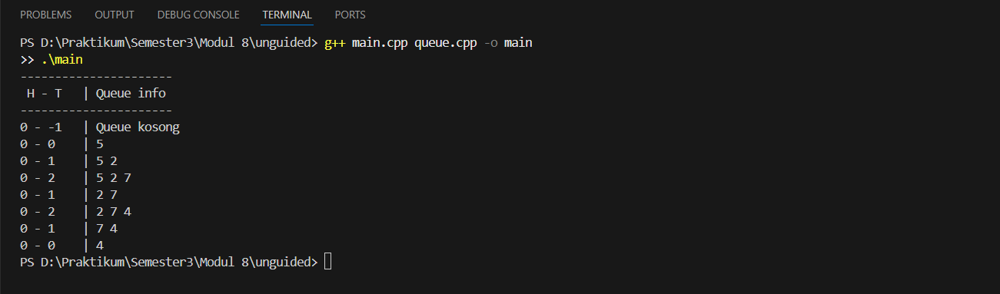
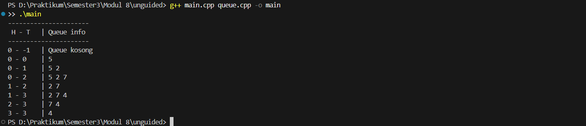

# <h1 align="center">LAPORAN PRAKTIKUM MODUL 8 <br> QUEUE </h1>
<p align="center">SETYO NUGROHO - 103112400024</p>

## Dasar Teori

### QUEUE

Queue adalah salah satu struktur data linear yang bekerja dengan prinsip FIFO (First In First Out), yaitu elemen yang pertama masuk akan menjadi elemen pertama yang keluar. Struktur ini dapat dianalogikan seperti antrean di loket, di mana orang yang datang lebih dulu akan dilayani terlebih dahulu. Secara umum, queue memiliki dua operasi dasar: enqueue untuk menambahkan elemen di bagian akhir (tail), dan dequeue untuk menghapus elemen di bagian depan (head). Queue dapat diimplementasikan menggunakan linked list maupun array (tabel). Pada representasi linked list, proses insert dilakukan pada tail dan delete dilakukan pada head, sehingga tidak diperlukan pergeseran data. Sedangkan pada representasi tabel terdapat tiga alternatif mekanisme: Alternatif 1 yaitu head tetap dan tail maju (namun operasi delete membutuhkan pergeseran data sehingga kurang efisien), Alternatif 2 yaitu head dan tail sama-sama bergerak tetapi dapat terjadi kondisi “penuh semu”, dan Alternatif 3 yaitu circular queue di mana index head dan tail berputar mengelilingi array sehingga lebih efisien tanpa pergeseran. Queue digunakan dalam banyak aplikasi seperti sistem antrian, buffer, schedulers, dan proses service yang mengikuti aturan FIFO.

## Guided

### Guided Queue

#### queue.cpp

```cpp
#include <iostream>
using namespace std;

#define MAX 5 // ukuran maksimal queue

// Struktur Queue
struct Queue {
    int data[MAX];
    int head;
    int tail;
};

// Membuat antrean kosong
void createQueue(Queue &Q) {
    Q.head = -1;
    Q.tail = -1;
}

bool isEmpty(Queue Q) {
    return (Q.head == -1 && Q.tail == -1);
}

bool isFull(Queue Q) {
    return (Q.tail == MAX - 1);
}

// Menampilkan isi antrian
void printQueue(Queue Q) {
    if (isEmpty(Q)) {
        cout << "Queue kosong!" << endl;
    } else {
        cout << "Queue : ";
        for (int i = Q.head; i <= Q.tail; i++) {
            cout << Q.data[i] << " ";
        }
        cout << endl;
    }
}

void enqueue(Queue &Q, int x) {
    if (isFull(Q)) {
        cout << "Queue penuh! Tidak bisa menambah data." << endl;
    } else {
        if (isEmpty(Q)) {
            Q.head = Q.tail = 0;
        } else {
            Q.tail++;
        }
        Q.data[Q.tail] = x;
        cout << "Enqueue: " << x << endl;
    }
}

void dequeue(Queue &Q) {
    if (isEmpty(Q)) {
        cout << "Queue kosong! Tidak ada data yang dihapus." << endl;
    } else {
        cout << "Dequeue: " << Q.data[Q.head] << endl;
        // Jika hanya 1 elemen
        if (Q.head == Q.tail) {
            Q.head = Q.tail = -1;
        } else {
            // Geser semua elemen ke kiri
            for (int i = Q.head; i < Q.tail; i++) {
                Q.data[i] = Q.data[i + 1];
            }
            Q.tail--;
        }
    }
}

int main() {
    Queue Q;
    createQueue(Q);
    enqueue(Q, 5);
    enqueue(Q, 2);
    enqueue(Q, 7);
    printQueue(Q);
     
    dequeue(Q);
    printQueue(Q);

    enqueue(Q, 4);
    enqueue(Q, 9);
    printQueue(Q);

    dequeue(Q);
    dequeue(Q);
    printQueue(Q);

    return 0;
}
```

> Output
> 

Program ini membuat struktur data Queue menggunakan array berukuran 5 dengan prinsip FIFO (First In First Out). Indeks head menunjuk elemen depan dan tail menunjuk elemen belakang. Operasi enqueue menambah data di bagian tail; jika queue kosong, head dan tail di-set ke 0. Jika penuh, program memberi pesan error. Operasi dequeue menghapus elemen paling depan; jika hanya satu elemen, queue kembali kosong. Jika lebih dari satu, semua elemen digeser ke kiri sehingga head tetap di posisi awal. Fungsi printQueue digunakan untuk menampilkan isi antrian. Program ini menunjukkan cara kerja Queue Alternatif 1, di mana setiap penghapusan menggeser elemen karena head tidak bergerak.

## Unguided

### Soal 1

1. Buatlah ADT Queue menggunakan ARRAY sebagai berikut di dalam file “queue.h”:
```
Type infotype: integer
Type Queue: <
    info : array [5] of infotype {index array dalam C++
    dimulai dari 0}
    head, tail : integer
>
procedure CreateQueue (input/output Q: Queue)
function isEmptyQueue (Q: Queue) → boolean
function isFullQueue (Q: Queue) → boolean
procedure enqueue (input/output Q: Queue, input x: infotype)
function dequeue (input/output Q: Queue) → infotype
procedure printInfo (input Q: Queue)
```
Buatlah implementasi ADT Queue pada file “queue.cpp” dengan menerapkan mekanisme queue Alternatif 1 (head diam, tail bergerak).
```
int main() {
    cout << "Hello World" << endl;
    Queue Q;
    createQueue(Q);
    
    cout<<"----------------------"<<endl;
    cout<<" H - T \t | Queue info"<<endl;
    cout<<"----------------------"<<endl;
    printInfo(Q);
    enqueue(Q,5); printInfo(Q);
    enqueue(Q,2); printInfo(Q);
    enqueue(Q,7); printInfo(Q);
    dequeue(Q); printInfo(Q);
    enqueue(Q,4); printInfo(Q);
    dequeue(Q); printInfo(Q);
    dequeue(Q); printInfo(Q);

    return 0;
}
```

queue.h
```cpp
#ifndef QUEUE_H
#define QUEUE_H

const int MAX = 5;

typedef int infotype;

struct Queue {
    infotype info[MAX];
    int head;
    int tail;
};

void createQueue(Queue &Q);
bool isEmptyQueue(Queue Q);
bool isFullQueue(Queue Q);
void enqueue(Queue &Q, infotype x);
infotype dequeue(Queue &Q);
void printInfo(Queue Q);

#endif
```

queue.cpp (alternatif 1)
```
#include <iostream>
#include "queue.h"
using namespace std;

void createQueue(Queue &Q){
    Q.head = 0;
    Q.tail = -1;
}

bool isEmptyQueue(Queue Q){
    return Q.tail == -1;
}

bool isFullQueue(Queue Q){
    return Q.tail == MAX - 1;
}

void enqueue(Queue &Q, infotype x){
    if(isFullQueue(Q)){
        cout << "Queue penuh" << endl;
        return;
    }
    Q.tail++;
    Q.info[Q.tail] = x;
}

infotype dequeue(Queue &Q){
    if(isEmptyQueue(Q)){
        cout << "Queue kosong" << endl;
        return -1;
    }
    infotype val = Q.info[Q.head];

    for(int i = 0; i < Q.tail; i++){
        Q.info[i] = Q.info[i + 1];
    }
    Q.tail--;

    return val;
}

void printInfo(Queue Q){
    cout << Q.head << " - " << Q.tail << "\t | ";
    if(isEmptyQueue(Q)){
        cout << "Queue kosong";
    } else {
        for(int i = 0; i <= Q.tail; i++){
            cout << Q.info[i] << " ";
        }
    }
    cout << endl;
}
```

main.cpp
```
#include <iostream>
#include "queue.h"
using namespace std;

int main() {
    Queue Q;
    createQueue(Q);

    cout << "----------------------" << endl;
    cout << " H - T \t | Queue info" << endl;
    cout << "----------------------" << endl;

    printInfo(Q);
    enqueue(Q, 5); printInfo(Q);
    enqueue(Q, 2); printInfo(Q);
    enqueue(Q, 7); printInfo(Q);
    dequeue(Q);    printInfo(Q);
    enqueue(Q, 4); printInfo(Q);
    dequeue(Q);    printInfo(Q);
    dequeue(Q);    printInfo(Q);

    return 0;
}
```

> Output
> 

Pada program Queue Alternatif 1, struktur antrean direpresentasikan menggunakan array dengan ukuran tetap, di mana posisi head selalu berada di indeks awal dan tidak bergerak. Setiap kali elemen baru masuk, nilai tail akan bertambah satu dan elemen disimpan di posisi tersebut. Ketika dilakukan operasi dequeue, elemen pada posisi head diambil, dan seluruh elemen di belakangnya harus digeser satu posisi ke kiri untuk mempertahankan head tetap di indeks awal. Cara ini membuat proses penghapusan menjadi tidak efisien karena membutuhkan pergeseran data setiap kali elemen dihapus. Meskipun mekanismenya sederhana dan mudah dipahami, alternatif ini memiliki kelemahan yaitu risiko pemborosan waktu akibat pergeseran elemen yang dilakukan berulang-ulang, terutama jika queue berukuran besar. Alternatif 1 hanya cocok digunakan untuk antrean kecil dan operasi sederhana.

### Soal 2

Buatlah implementasi ADT Queue pada file “queue.cpp” dengan menerapkan mekanisme
queue Alternatif 2 (head bergerak, tail bergerak).

untuk file header (queue.h) dan program utama (main.cpp) sama dengan nomor 1 yang berbeda hanya file queue.cpp

queue.cpp (alternatif 2)
```
#include <iostream>
#include "queue.h"
using namespace std;

void createQueue(Queue &Q){
    Q.head = 0;
    Q.tail = -1;
}

bool isEmptyQueue(Queue Q){
    return Q.tail < Q.head;
}

bool isFullQueue(Queue Q){
    return Q.tail == MAX - 1;
}

void enqueue(Queue &Q, infotype x){
    if(isFullQueue(Q)){
        cout << "Queue penuh" << endl;
        return;
    }
    if(isEmptyQueue(Q)){
        Q.head = 0;
        Q.tail = 0;
    } else {
        Q.tail++;
    }
    Q.info[Q.tail] = x;
}

infotype dequeue(Queue &Q){
    if(isEmptyQueue(Q)){
        cout << "Queue kosong" << endl;
        return -1;
    }

    infotype val = Q.info[Q.head];
    Q.head++;

    if(Q.head > Q.tail){
        createQueue(Q);
    }

    return val;
}

void printInfo(Queue Q){
    cout << Q.head << " - " << Q.tail << "\t | ";
    if(isEmptyQueue(Q)){
        cout << "Queue kosong";
    } else {
        for(int i = Q.head; i <= Q.tail; i++){
            cout << Q.info[i] << " ";
        }
    }
    cout << endl;
}
```


> Output
> 

Pada program Queue Alternatif 2, antrean juga direpresentasikan menggunakan array, tetapi berbeda dengan alternatif sebelumnya, baik head maupun tail dapat bergerak maju. Operasi enqueue akan menambah elemen pada indeks tail dan tail akan bertambah satu setiap kali elemen dimasukkan. Pada operasi dequeue, elemen pada indeks head diambil, lalu head juga bergerak maju satu posisi. Namun, karena head ikut bergerak, dapat terjadi kondisi di mana ruang kosong tercipta di depan array, tetapi Tail sudah mencapai batas akhir, sehingga tampak seolah-olah queue penuh padahal sebenarnya masih ada ruang. Kondisi ini disebut “queue penuh semu”. Pada alternatif ini tidak ada pergeseran elemen, sehingga lebih efisien dibandingkan alternatif pertama, namun manajemen indeks menjadi kurang optimal karena ruang kosong di depan tidak dapat langsung digunakan tanpa reset atau realokasi ulang antrean.

### Soal 3

Buatlah implementasi ADT Queue pada file “queue.cpp” dengan menerapkan mekanisme
queue Alternatif 3 (head dan tail berputar).

untuk file header (queue.h) dan program utama (main.cpp) sama dengan nomor 1 yang berbeda hanya file queue.cpp

queue.cpp (alternatif 3)
```
#include <iostream>
#include "queue.h"
using namespace std;

void createQueue(Queue &Q){
    Q.head = -1;
    Q.tail = -1;
}

bool isEmptyQueue(Queue Q){
    return Q.head == -1;
}

bool isFullQueue(Queue Q){
    return (Q.tail + 1) % MAX == Q.head;
}

void enqueue(Queue &Q, infotype x){
    if(isFullQueue(Q)){
        cout << "Queue penuh" << endl;
        return;
    }

    if(isEmptyQueue(Q)){
        Q.head = Q.tail = 0;
    } else {
        Q.tail = (Q.tail + 1) % MAX;
    }
    Q.info[Q.tail] = x;
}

infotype dequeue(Queue &Q){
    if(isEmptyQueue(Q)){
        cout << "Queue kosong" << endl;
        return -1;
    }

    infotype val = Q.info[Q.head];

    if(Q.head == Q.tail){
        createQueue(Q);
    } else {
        Q.head = (Q.head + 1) % MAX;
    }

    return val;
}

void printInfo(Queue Q){
    cout << Q.head << " - " << Q.tail << "\t | ";
    if(isEmptyQueue(Q)){
        cout << "Queue kosong";
    } else {
        int i = Q.head;
        while(true){
            cout << Q.info[i] << " ";
            if(i == Q.tail) break;
            i = (i + 1) % MAX;
        }
    }
    cout << endl;
}
```


> Output
> 

Program Queue Alternatif 3 menggunakan konsep circular queue, yaitu indeks head dan tail yang dapat berputar kembali ke awal array setelah mencapai indeks terakhir. Implementasi ini mengatasi masalah “penuh semu” pada alternatif 2 dengan memperlakukan array sebagai lingkaran menggunakan operasi modulo ((index + 1) % MAX). Pada operasi enqueue, nilai tail akan maju satu posisi secara melingkar, dan pada operasi dequeue, head juga bergerak dengan cara yang sama. Queue dianggap penuh jika posisi tail berikutnya sama dengan posisi head, dan dianggap kosong ketika head bernilai -1. Alternatif ini adalah implementasi yang paling efisien karena tidak membutuhkan pergeseran elemen dan dapat memanfaatkan seluruh kapasitas array dengan optimal. Circular queue banyak digunakan pada sistem nyata seperti buffer data, manajemen proses, dan jaringan komputer.

## Referensi

Modul 8 QUEUE, Modul Praktikum.

W3School-Queue https://www.w3schools.com/cpp/cpp_queues.asp Diakses pada 17 November 2025


