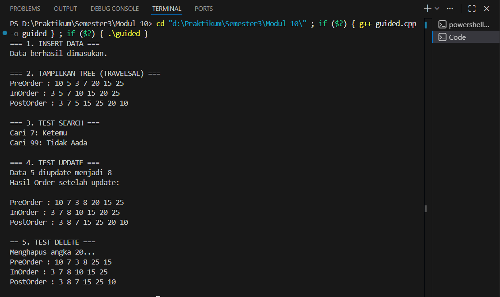
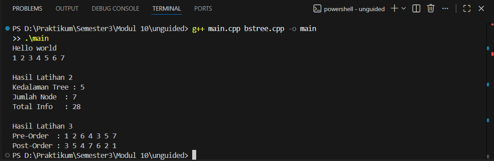

# <h1 align="center">Laporan Praktikum Modul 10 <br>TREE</h1>
<p align="center">SETYO NUGROHO - 103112400024</p>

## Dasar Teori
Modul ini berpusat pada dua konsep fundamental dalam pemrograman: Rekursif dan Binary Search Tree (BST). Rekursif merupakan teknik pemrograman di mana sebuah fungsi memanggil dirinya sendiri, menjadikannya sangat ideal untuk memproses struktur data yang bersifat definisional-diri (self-referential), seperti tree. Dalam konteks tree, rekursif memungkinkan operasi penjelajahan (traversal), pencarian, dan pemasukan data dilakukan dengan kode yang ringkas dan logis. Tree sendiri didefinisikan sebagai struktur data non-linear yang terdiri dari node-node yang terhubung, dengan satu node utama yang disebut root dan tidak mengandung siklus. Secara spesifik, BST adalah jenis Binary Tree (maksimum dua turunan per node) yang terurut, di mana setiap node harus mematuhi aturan bahwa semua data di sub-tree kiri harus lebih kecil dari nilai node tersebut, dan semua data di sub-tree kanan harus lebih besar. Keterurutan ini menjadi kunci efisiensi BST dalam operasi pencarian data, yang memiliki kompleksitas waktu rata-rata $O(\log n)$. Operasi-operasi kunci pada BST meliputi Insert (pemasukan), Search (pencarian), Delete (penghapusan), dan Traversal (penjelajahan dengan metode In-Order, Pre-Order, dan Post-Order).

## Guided

### Guided
```c++
#include <iostream>
using namespace std;

struct Node
{
    int data;
    Node *kiri, *kanan;
};

Node *buatNode(int nilai)
{
    Node *baru = new Node();
    baru->data = nilai;
    baru->kiri = baru->kanan = NULL;
    return baru;
}

Node *insert(Node *root, int nilai)
{
    if (root == NULL)
        return buatNode(nilai);
    
    if (nilai < root->data)
        root->kiri = insert(root->kiri, nilai);
    else if (nilai > root->data)
        root->kanan = insert(root->kanan, nilai);

    return root;
}

Node *search(Node *root, int nilai)
{
    if (root == NULL || root->data == nilai)
        return root;

    if (nilai < root->data)
        return search(root->kiri, nilai);

    return search(root->kanan, nilai);
}

Node *nilaiTerkecil(Node *node)
{
    Node *current = node;
    while (current && current->kiri != NULL)
        current = current->kiri;

        return current;
}

Node *hapus(Node *root, int nilai)
{
    if (root == NULL)
        return root;

    if (nilai < root->data)
        root->kiri = hapus(root->kiri, nilai);
    else if (nilai > root->data)
        root->kanan = hapus(root->kanan, nilai);
    else
    {
        if (root->kiri == NULL)
        {
            Node *temp = root->kanan;
            delete root;
            return temp;
        }
        else if (root->kanan == NULL){
            Node *temp = root->kiri;
            delete root;
            return temp;
        }
        Node *temp = nilaiTerkecil(root->kanan);
        root->data = temp->data;
        root->kanan = hapus(root->kanan, temp->data);
    }
    return root;
}

Node *update(Node *root, int Lama, int baru)
{
    if (search(root, Lama) != NULL)
    {
        root = hapus(root, Lama);
        root = insert(root, baru);
        cout << "Data " << Lama << " diupdate menjadi " << baru << endl;
    }
    else
    {
        cout << "Data " << Lama << " tidak ditemukan!" << endl;
    }
    return root;
}

void preOrder(Node *root)
{
    if (root != NULL)
    {
        cout << root->data << " ";
        preOrder(root->kiri);
        preOrder(root->kanan);
    }
}

void inOrder(Node *root)
{
    if (root != NULL)
    {
        inOrder(root->kiri);
        cout << root->data << " ";
        inOrder(root->kanan);
    }
}

void postOrder(Node *root)
{
    if (root != NULL)
    {
        postOrder(root->kiri);
        postOrder(root->kanan);
        cout << root->data << " ";
    }
}

int main()
{
    Node *root = NULL;

    cout << "=== 1. INSERT DATA ===" << endl;
    root = insert(root, 10);
    insert(root, 5);
    insert(root, 20);
    insert(root, 3);
    insert(root, 7);
    insert(root, 15);
    insert(root, 25);
    cout << "Data berhasil dimasukan.\n" << endl;

    cout << "=== 2. TAMPILKAN TREE (TRAVELSAL) ===" << endl;
    cout << "PreOrder : ";
    preOrder(root);
    cout << endl;
    cout << "InOrder : ";
    inOrder(root);
    cout << endl;
    cout << "PostOrder : ";
    postOrder(root);
    cout << "\n" << endl;

    cout << "=== 3. TEST SEARCH ===" << endl;
    int cari1 = 7, cari2 = 99;
    cout << "Cari " << cari1 << ": " << (search(root,cari1) ? "Ketemu" : "Tidak Aada") << endl;
    cout << "Cari " << cari2 << ": " << (search(root,cari2) ? "Ketemu" : "Tidak Aada") << endl;
    cout << endl;

    cout << "=== 4. TEST UPDATE ===" << endl;
    root = update(root, 5, 8);
    cout << "Hasil Order setelah update: ";
    cout << endl;
    cout << endl;

    cout << "PreOrder : ";
    preOrder(root);
    cout << endl;
    cout << "InOrder : ";
    inOrder(root);
    cout << endl;
    cout << "PostOrder : ";
    postOrder(root);
    cout << "\n" << endl;

    cout << "== 5. TEST DELETE ===" << endl;
    cout << "Menghapus angka 20..." << endl;
    root = hapus(root, 20);

    cout << "PreOrder : ";
    preOrder(root);
    cout << endl;
    cout << "InOrder : ";
    inOrder(root);
    cout << endl;
    cout << "PostOrder : ";
    postOrder(root);
    cout << "\n" << endl;

    return 0;
}
```

> Output
> 
> 

Program ini adalah implementasi Binary Search Tree yang lebih komprehensif, terfokus pada demonstrasi operasi manipulasi data. Program ini menguji fungsi-fungsi inti seperti Insert (data awal: $10, 5, 20, 3, 7, 15, 25$), Search (menguji keberadaan $7$ dan $99$), Delete (hapus), dan Update. Fungsi update di sini dirancang dengan menggabungkan operasi delete data lama dan insert data baru, yang merupakan metode standar untuk menjamin bahwa tree yang diubah tetap memenuhi aturan BST, karena perubahan nilai tunggal berpotensi melanggar urutan BST. Program mendemonstrasikan tahapan kritis, termasuk Update nilai $5$ menjadi $8$ dan Delete nilai $20$, yang merupakan kasus penghapusan node dengan dua turunan dan memerlukan pencarian Inorder Successor (nilaiTerkecil) untuk menjaga integritas tree. Setelah setiap operasi manipulasi data, program menampilkan hasil Pre-Order, In-Order, dan Post-Order Traversal yang telah diperbarui, memungkinkan pengguna untuk memvisualisasikan perubahan struktural dan urutan data di BST secara bertahap.

## UNGUIDED

#### bstree.h
```c++
#ifndef BSTREE_H
#define BSTREE_H

#include <iostream>
#include <algorithm>

typedef int infotype;
typedef struct Node *address;

struct Node {
    infotype info;
    address left;
    address right;
};

#define Nil NULL

// --- Fungsi Primitif BST (Soal 1) ---
address alokasi(infotype x);
void insertNode(address &root, infotype x);
void printInorder(address root);

// --- Fungsi Traversal Tambahan (Soal 3) ---
void printPreorder(address root);
void printPostorder(address root);

// --- Fungsi Perhitungan (Soal 2) ---
int hitungJumlahNode(address root);
int hitungTotalInfo(address root);
int hitungKedalaman(address root);

#endif
```
#### bstree.cpp
```c++
#include "bstree.h"
#include <iostream>

using namespace std;

// IMPLEMENTASI SOAL 1 & 3 (INSERT & TRAVERSAL)

address alokasi(infotype x) {
    address newNode = new Node;
    if (newNode != Nil) {
        newNode->info = x;
        newNode->left = Nil;
        newNode->right = Nil;
    }
    return newNode;
}

void insertNode(address &root, infotype x) {
    if (root == Nil) {
        root = alokasi(x);
    } else {
        if (x < root->info) {
            insertNode(root->left, x);
        } else if (x > root->info) {
            insertNode(root->right, x);
        }
    }
}

void printInorder(address root) {
    if (root != Nil) {
        printInorder(root->left);  
        cout << root->info << " "; 
        printInorder(root->right); 
    }
}

void printPreorder(address root) {
    if (root != Nil) {
        cout << root->info << " ";  
        printPreorder(root->left);  
        printPreorder(root->right); 
    }
}


void printPostorder(address root) {
    if (root != Nil) {
        printPostorder(root->left);  
        printPostorder(root->right); 
        cout << root->info << " ";   
    }
}

// IMPLEMENTASI SOAL 2 (PERHITUNGAN)

int hitungJumlahNode(address root) {
    if (root == Nil) {
        return 0;
    } else {
        return 1 + hitungJumlahNode(root->left) + hitungJumlahNode(root->right);
    }
}

int hitungTotalInfo(address root) {
    if (root == Nil) {
        return 0;
    } else {
        return root->info + hitungTotalInfo(root->left) + hitungTotalInfo(root->right);
    }
}

int hitungKedalaman(address root) {
    if (root == Nil) {
        return 0;
    } else {
        return 1 + max(hitungKedalaman(root->left), hitungKedalaman(root->right));
    }
}
```
#### main.cpp
```c++
#include <iostream>
#include "bstree.h" 

using namespace std;

int main() {
    cout << "Hello world" << endl;
    address root = Nil;

    insertNode(root, 1);
    insertNode(root, 2);
    insertNode(root, 6);
    insertNode(root, 4);
    insertNode(root, 5);
    insertNode(root, 3);
    insertNode(root, 6);
    insertNode(root, 7);
    
    // --- Output Soal 1 (In-Order Traversal) ---
    printInorder(root); 
    cout << endl;
    
    // --- Output Soal 2 (Perhitungan) ---
    cout << "\nHasil Latihan 2" << endl;
    
    // Output perhitungan:
    cout << "Kedalaman Tree : " << hitungKedalaman(root) << endl;
    cout << "Jumlah Node  : " << hitungJumlahNode(root) << endl;
    cout << "Total Info   : " << hitungTotalInfo(root) << endl;
    
    // --- Output Soal 3 (Traversal Pre-Order dan Post-Order) ---
    cout << "\nHasil Latihan 3" << endl;
    
    cout << "Pre-Order  : "; 
    printPreorder(root);
    cout << endl;
    
    cout << "Post-Order : "; 
    printPostorder(root);
    cout << endl;

    return 0;
}
```
> Output soal 1,2,3
> 
> 

Program ini merupakan implementasi dasar ADT Binary Search Tree dalam C++ yang dibagi menjadi tiga file (header, implementasi, dan utama). Program ini bertujuan untuk membangun pemahaman fundamental mengenai BST dengan menggunakan data insert $1, 2, 6, 4, 5, 3, 6, 7$, di mana data $6$ yang kedua diabaikan karena merupakan duplikat. Setelah pembangunan tree, program menjalankan tiga tugas utama yang merepresentasikan soal latihan: pertama, melakukan In-Order Traversal yang menghasilkan data terurut $1 \ 2 \ 3 \ 4 \ 5 \ 6 \ 7$. Kedua, mengimplementasikan fungsi-fungsi analisis tree untuk menghitung Kedalaman/Tinggi tree (menghasilkan nilai $5$), Jumlah Node ($7$), dan Total Info (penjumlahan seluruh nilai data, menghasilkan $28$). Ketiga, program melengkapi demonstrasi penjelajahan tree dengan menampilkan hasil Pre-Order ($1 \ 2 \ 6 \ 4 \ 3 \ 5 \ 7$) dan Post-Order ($3 \ 5 \ 4 \ 7 \ 6 \ 2 \ 1$), menunjukkan bagaimana BST dapat dimanipulasi dan dianalisis menggunakan prinsip rekursif untuk memverifikasi sifat-sifat strukturalnya.


## Referensi

Modul 10 TREE, Modul Praktikum.
